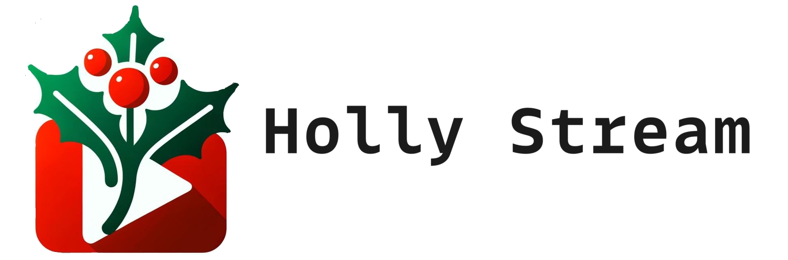

This application will ingest your computers webcam feed (using ffmpeg), apply an object detection task on the feed with bounding boxes, and send that feed via RTMP to an address of your choice. You can also turn off object detection to create a simple live stream camera, good for a security system or monitoring system.

# Prerequisites
There are a couple of recommended steps before you can run this application.

## (recommended) Allocate swap memory
Allocating more swap memory will use storage if your device needs more memory. You can do so with the following commands:
```bash
sudo fallocate -l 4G /var/swapfile 
sudo chmod 600 /var/swapfile
sudo mkswap /var/swapfile
sudo swapon /var/swapfile
sudo bash -c "echo '/var/swapfile swap swap defaults 0 0'  >> /etc/fstab"
```

## (required) Allow Docker GPU access
In order to allow Docker access to your Jetson GPU, you will have to add the following argument, `"default-runtime": "nvidia"` to the file `/etc/docker/daemon.json`:
```bash
{
    "runtimes": {
        "nvidia": {
            "path": "nvidia-container-runtime",
            "runtimeArgs": []
        }
    },
    "default-runtime": "nvidia"
}
```
Once you add the line, restart the docker daemon with `sudo systemctl restart docker`.

## (required) Install Docker Compose
Install this on the Ubuntu system Python environment (not inside a venv, virtualenv, or Conda evironment):
```bash
pip3 install --upgrade pip
pip3 install docker-compose==1.27.4
```

Check if it was installed correctly:
```bash
docker-compose version
```

## (optional) Train a custom YOLOv5 model
This repository comes supplied with the default YOLOv5 medium model, trained on 80 [classes](#change-the-default-class-predictor). It is already in TensorRT format (`model.plan`) optimzed to run on Jetson Nano architecture. However, you can train your own custom model using the [YOLOv5 repo](https://github.com/ultralytics/yolov5). Follow these steps if you want to train a model from scratch. It is highly recommended to use a CUDA-enabled machine for training. If you already have a trained model in PyTorch format (`.pt`) skip to step 4.

1. Gather data. Collect images of the object(s) you want to detect. I created a script at `app/collect_data.py` to make this process easier.

2. Annotate your data in YOLO format. I highly recommend [Roboflow](https://roboflow.com/) for this and using a 70/30 split between your training and validation data.

3. Train your model. A CUDA-enabled machine is highly encouraged for this step. A training script will look something like this:
    ```bash
    python train.py \
    --weights yolov5s.pt \
    --cfg yolov5s.yaml \
    --data data.yaml \
    --epochs 1000 \
    --batch-size 16 \
    --optimizer AdamW \
    --device 0
    ```

4. After training, export your model as ONNX. Set the `--opset` to 15 for Jetson Nano compatability. If you want a pretrained YOLOv5 model, simply add the model name to `--weights` (e.g. `--weights yolov5s.pt`). The `--half` flg with convert model parameters that are float32 to float16, reducing model size and increasing inference speed.
    ```bash
    python export.py \
    --include onnx \
    --weights best.pt \
    --half \
    --opset 15 \
    --device 0
    ```

5. Copy your ONNX model to your Jetson Nano.

6. Convert your model to TensorRT. TensorRT model are specific to the machine you convert it on. If you are inferencing your model on a Jetson Nano you have create the TensorRT model on your Jetson Nano. Luckily, the software needed is built-in to the Jetson. If you did not use the `--half` flag in step 4, leave off the flags `--fp16` and after.
    ```bash
    /usr/src/tensorrt/bin/trtexec \
    --onnx=./path/to/model.onnx \
    --saveEngine=./path/to/save/model.plan \
    --explicitBatch \
    --fp16 \
    --inputIOFormats=fp16:chw \
    --outputIOFormats=fp16:chw
    ```

7. Move the model to the correct location, `holly-stream/triton/object_detection/1/model.plan`.

# Installation
You can use Docker or the native operating system:

## Docker Installation
Pull the Jetson Image:
```bash
docker pull rcland12/detection-stream:jetson-latest
docker pull rcland12/detection-stream:jetson-triton-latest
```

## Non-Docker Installation
This install script will install all dependencies needed for this application, including OpenCV, PyTorch, Torchvision, and the Triton Inference Server/Client. You will be prompted to type your password in multiple times, and this script should take roughly two or three hours to complete. WARNING: This script has only been testing on a Jetson Nano (JetPack OS 4.6.4).
```bash
./install.sh
```

# Deployment
You have the following options for serving this feed:

1. To the same device (localhost).
2. To another local device (LAN).
3. To a remote web server (WAN).

You have two options for reading in this stream (client):

1. [Media player (VLC, Windows Media Player, etc.)](#watching-stream-through-streaming-software)
2. [Web page via Nginx/HLS.](#watching-stream-through-web-browser)

Pick an option from each list and follow the instructions below to deploy. If you are new to object detection I recommend you stick to the default model provided. Otherwise, you can supply your own YOLOv5 model.

---

Create an `.env` file to define parameters you wish to change. If you do not define a parameter it will default to a value given below, but you must define an empty `.env` file at minimum.
```bash
touch .env
```

Here is a list of all possible arguments:
```bash
OBJECT_DETECTION=True
MODEL=yolov5s
CLASSES=None
MODEL_DIMS=(640, 640)
CONFIDENCE_THRESHOLD=0.3
IOU_THRESHOLD=0.25

STREAM_IP=127.0.0.1
STREAM_PORT=1935
STREAM_APPLICATION=live
STREAM_KEY=stream

CAMERA_INDEX=0
CAMERA_WIDTH=1280
CAMERA_HEIGHT=720
CAMERA_FPS=22
SANTA_HAT_PLUGIN=False
```

A few comments about the parameters:
- The `OBJECT_DETECTION` variable is a boolean to turn that tasks on/off. If you turn it off you simply have a live stream feed.
- You can use any custom trained YOLOv5 model for the `MODEL` parameter.
- The `CLASSES` variable takes in a list. If you wish to include all possible classes, remove it from the `.env` file. The possible classes for the default model are [listed below](#change-the-default-class-predictor).
- `MODEL_DIMS` must match the model dimensions for the model supplied.
- The `CONFIDENCE_THRESHOLD` and `IOU_THRESHOLD` arguments are used in non-maximum supression in the postprocess model.
- All arguments accept the data type present above. `STREAM_IP` takes a string, `STREAM_PORT` takes an integer, `STREAM_APPLICATION` takes a string, etc.
---
- If you are watching the stream on the same device set the `STREAM_IP` to `127.0.0.1`, or whatever localhost address you want.
- If you are streaming the feed to another device on your local network, set the `STREAM_IP` to the IPV4 address of that device. To find the IP address of a device on Linux machine run `ip a` and look for it under `wl01` or something similar. If your Linux machine is running a firewall (e.g. ufw), set an allow rule for port 1935: `sudo ufw allow 1935`. On a windows machine open Windows Powershell and run `ipconfig` and look for `IP address`. On a Windows machine you will most likely need to expose a port (1935 is default) in order to receive the stream. Do this by adding an [Inbound Rule](https://www.tomshardware.com/news/how-to-open-firewall-ports-in-windows-10,36451.html).
- If you are streaming the feed to another server set the `STREAM_IP` to the public IP address for that server. Also make sure you expose port 1935 on the firewall and router if necessary for the server your sending the stream to.
---
- The variable `SANTA_HAT_PLUGIN`, if set to True, will not add a bounding box, but a santa hat to the object with the highest probability score. I use this parameter when detecting my dog using a custom model, especially around Christmas!
The application is ready to launch, so pick the method for receiving the stream:

Lastly, to receive the stream on the device you picked above you have two options:

1. [Watch the stream on streaming software such as VLC, Windows Media Player, OBS.](#watching-stream-through-streaming-software)
2. [Watch the stream through a browser.](#watching-stream-through-web-browser)

## Watching stream through streaming software
The client machine you are using must have Docker and the compose plugin. You will now launch a container that will pick up the feed and send it to your streaming software. If you already have Nginx running on port 1935 on your machine you will have to stop that service before you start this one.

```bash
docker compose up -d nginx-stream
```

Once the client software is running you can launch the streaming application from the server side (Jetson device):
```bash
./run.sh
```

Lastly, on the client side you can open up your streaming software and find where you can watch a network stream or URL stream, then use the address you set up in the parameters:
```bash
rtmp://<STREAM_IP>:<STREAM_PORT>/<STREAM_APPLICATION>/<STREAM_KEY>

# example
rtmp://127.0.0.1:1935/live/stream
```

If `127.0.0.1` does not work, try `0.0.0.0`.

To stop the running services on the server (Raspberry Pi), run:
```bash
./stop.sh
```

To stop the running services on the client, run:
```bash
docker compose down
```

## Watching stream through web browser
The client machine you are using must have Docker and the compose plugin. You will now launch a container that will start a web server on localhost port 80. If you already have Nginx running on port 1935 on your machine you will have to stop that service before you start this one.

```bash
docker compose up -d nginx-web
```

Once the client software is running you can launch the streaming application from the server side (Jetson device):
```bash
./run.sh
```

Lastly, on the client side navigate to the web address `http://localhost/stream.html`. If you plan on serving this stream on a live web server, following the instructions in the next section.

To stop the running services on the server (Raspberry Pi), run:
```bash
./stop.sh
```

To stop the running services on the client, run:
```bash
docker compose down
```

## Streaming the feed to a web server
If you are streaming to a remote web server most of the steps will be the same. You will clone the repo on your web server. Before you launch the service you will have to make a few changes.

File `nginx/stream/stream.html`:
- Everywhere there is a `http://localhost`, replace it with your domain name: `https://website.com`.
- On line 20, replace the last part of the src, `stream.m3u8`, with your stream key: `<stream_key>.m3u8`. This prevents people on your same network from streaming a video to your website.

File `nginx/nginx-web/nginx.conf`:
- Whitelist your IP address by first finding your home IP address (you can do so [here](https://whatismyipaddress.com/)).
- Under the rtmp block, aroud lines 40-43 add another line with `allow publish <your_ipv4>;`. Don't forget the semicolon.
- Add your domain name on line 27. Replace `server_name localhost;` with `server_name website.com;`.Don't forget the semicolon.
- If for some reason you want to change the application name edit line 46 by replacing `application live` with `application <application_name>`. Then remember to also make that change in your `.env` file for the variable STREAM_APPLICATION.

Now you can launch this service on your web server:
```bash
docker compose run -d nginx-web
```

Once the client software is running you can launch the streaming application from the server side (Jetson device):
```bash
./run.sh
```

Lastly, you will be able to access the stream at `https://website.com/stream.html`. You can of course make changes to this and create a different route for this stream, but this is the minimum requirements.

To stop the running services on the server (Raspberry Pi), run:
```bash
./stop.sh
```

To stop the running services on the client, run:
```bash
docker compose down
```

## Change the default class predictor
By default this application detects 80 different classes. To change or add classes for detection, add a CLASSES environmental variable to your `.env` file, if you don't already have it. Remove it to inference on all classes below. Otherwise, use a list to add classes you want to inference on. Such as `CLASSES=[0, 16, 17, 54, 67]`.

| class_index  | class_name     |
|--------------|----------------|
| 0            | person         |
| 1            | bicycle        |
| 2            | car            |
| 3            | motorcycle     |
| 4            | airplane       |
| 5            | bus            |
| 6            | train          |
| 7            | truck          |
| 8            | boat           |
| 9            | traffic light  |
| 10           | fire hydrant   |
| 11           | stop sign      |
| 12           | parking meter  |
| 13           | bench          |
| 14           | bird           |
| 15           | cat            |
| 16           | dog            |
| 17           | horse          |
| 18           | sheep          |
| 19           | cow            |
| 20           | elephant       |
| 21           | bear           |
| 22           | zebra          |
| 23           | giraffe        |
| 24           | backpack       |
| 25           | umbrella       |
| 26           | handbag        |
| 27           | tie            |
| 28           | suitcase       |
| 29           | frisbee        |
| 30           | skis           |
| 31           | snowboard      |
| 32           | sports ball    |
| 33           | kite           |
| 34           | baseball bat   |
| 35           | baseball glove |
| 36           | skateboard     |
| 37           | surfboard      |
| 38           | tennis racket  |
| 39           | bottle         |
| 40           | wine glass     |
| 41           | cup            |
| 42           | fork           |
| 43           | knife          |
| 44           | spoon          |
| 45           | bowl           |
| 46           | banana         |
| 47           | apple          |
| 48           | sandwich       |
| 49           | orange         |
| 50           | brocolli       |
| 51           | carrot         |
| 52           | hot dog        |
| 53           | pizza          |
| 54           | donut          |
| 55           | cake           |
| 56           | chair          |
| 57           | couch          |
| 58           | potted plant   |
| 59           | bed            |
| 60           | dining table   |
| 61           | toilet         |
| 62           | tv             |
| 63           | laptop         |
| 64           | mouse          |
| 65           | remote         |
| 66           | keyboard       |
| 67           | cell phone     |
| 68           | microwave      |
| 69           | oven           |
| 70           | toaster        |
| 71           | sink           |
| 72           | refrigerator   |
| 73           | book           |
| 74           | clock          |
| 75           | vase           |
| 76           | scissors       |
| 77           | teddy bear     |
| 78           | hair drier     |
| 79           | toothbrush     |
