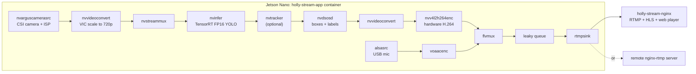

# Holly Stream (Jetson Nano)


Real-time object detection live stream for the NVIDIA Jetson Nano (JetPack 4.6.x).
YOLO runs on **every camera frame** at the full 28-30 fps and the annotated
video is published over RTMP, viewable in VLC or a browser. Built on NVIDIA
DeepStream 6.0.1, so frames stay in GPU/hardware memory from the camera to the
H.264 encoder.

## Table of Contents

- [How it works](#how-it-works)
- [Performance](#performance)
- [Project layout](#project-layout)
- [Requirements](#requirements)
- [Setup](#setup)
- [Watching the stream](#watching-the-stream)
- [Configuration](#configuration)
- [Monitoring](#monitoring)
- [Models](#models)
- [Training a custom model](#training-a-custom-model)
- [Troubleshooting](#troubleshooting)

## How it works


```mermaid
flowchart LR
    subgraph Nano["Jetson Nano: holly-stream-app container"]
        CAM["nvarguscamerasrc<br/>CSI camera + ISP"] --> VIC1["nvvideoconvert<br/>VIC scale to 720p"]
        VIC1 --> MUX["nvstreammux"]
        MUX --> INF["nvinfer<br/>TensorRT FP16 YOLO"]
        INF --> TRK["nvtracker<br/>(optional)"]
        TRK --> OSD["nvdsosd<br/>boxes + labels"]
        OSD --> VIC2["nvvideoconvert"]
        VIC2 --> ENC["nvv4l2h264enc<br/>hardware H.264"]
        MIC["alsasrc<br/>USB mic"] --> AAC["voaacenc"]
        ENC --> FLV["flvmux"]
        AAC --> FLV
        FLV --> Q["leaky queue"] --> RTMP["rtmpsink"]
    end
    RTMP --> NGINX["holly-stream-nginx<br/>RTMP + HLS + web player"]
    RTMP -. or .-> SERVER["remote nginx-rtmp server"]
```

- **Zero-copy.** The camera ISP, the VIC scaler, TensorRT and the hardware
  encoder all pass NVMM buffers. The CPU never touches a pixel, except to draw
  label text.
- **ONNX in, TensorRT out.** Models are shipped as ONNX. On the first start
  the app compiles the ONNX into a TensorRT FP16 engine for this exact GPU and
  TensorRT version, caches it as `models/<model>_fp16.engine`, and DeepStream
  runs that engine.
- **One small C program** (`app/src/holly_stream.c`) builds the pipeline from
  `.env`, colours boxes per class, logs live stats, and exits on errors or
  stalls so Docker restarts it.
- **YOLO parser** (`app/src/nvdsparsebbox_yolo.cpp`) reads the `[N, 6]` output
  of models exported with `models/export.py`. nvinfer then applies the
  threshold and optional NMS, and maps boxes back through the letterbox.
- **WiFi-tolerant output.** The queue in front of `rtmpsink` is bounded and
  drops the oldest data when the network stalls, so the camera and inference
  never back up. If nothing is sent for `WATCHDOG_SECONDS`, the process exits
  and Docker reconnects it.

## Performance

Measured on a Jetson Nano 4GB (MAXN, `MAX_PERFORMANCE=True`) with an IMX219 at
3264x1848@28 fps, 720p output, audio on, inference on **every** frame:

| Model (FP16) | Engine only | Live pipeline | Latency | GPU | CPU |
| --- | --- | --- | --- | --- | --- |
| **YOLO26n 640x384** (default) | 33.0 fps | **28.0 fps** | 41 ms | 84% | 36% |
| YOLO26n 512x288 | 49.8 fps | 28.0 fps | 29 ms | 64% | 34% |
| YOLO26n 416x256 | 67.7 fps | 28.0 fps | 22 ms | 51% | 32% |
| YOLO26n 320x192 | 97.4 fps | 28.0 fps | 18 ms | 35% | 32% |
| YOLO11n 640x384 | 27.7 fps | 26.4 fps | 155 ms | 98% | 33% |
| YOLO11n 512x288 | 46.0 fps | 28.0 fps | 30 ms | 75% | 32% |
| No detection | | 28.0 fps | 5 ms | 0% | 15% |

- "Live pipeline" is capped by the camera (28 fps). Latency is capture to
  encoded frame.
- YOLO26n is both faster and more accurate than YOLO11n on this GPU (COCO mAP
  40.9 vs 39.5), and it needs no NMS.
- Extra options measured with YOLO26n 640x384:
  - 1080p output: 28 fps, 46 ms latency, but 5.9 Mbps upload.
  - `INFERENCE_INTERVAL=2` with `TRACKER=iou` or `nvdcf`: inference at 9.4 fps,
    stream at 28 fps, GPU 15–40%.
- For comparison, the previous Triton + Python + ffmpeg version ran YOLO on
  every 10th frame (about 2.8 inferences/s).
- On WiFi, the 720p stream uploads about 2.7 Mbps. The Nano's link measured
  5–45 Mbps (bursty), so 720p "smooth" leaves headroom and 1080p does not.

## Project layout

```
.env.example              every setting, copy to .env
compose.yml               app (DeepStream) + nginx (RTMP/HLS/web player)
run.sh / stop.sh          start (waits for the pipeline) / stop
status.sh                 streaming, starting or stopped
app/
  Dockerfile              builds the C app on DeepStream 6.0.1
  entrypoint.sh           max-performance mode, then starts the app
  collect_data.sh         capture training images from the camera
  src/holly_stream.c      the pipeline
  src/nvdsparsebbox_yolo.cpp  YOLO output parser for nvinfer
  config/tracker_*.yml    optional object tracker settings
models/
  yolo26n_640x384.onnx    default model (COCO, 80 classes)
  yolo26n_512x288.onnx    lighter option
  labels.txt              COCO class names
  export.py               .pt -> DeepStream-ready .onnx (+ labels)
  train.py                labeled dataset -> trained, exported custom model
nginx/                    local RTMP + HLS server and web player
run-all-cameras.sh / stop-all-cameras.sh / status-all-cameras.sh   control several cameras over SSH
all-cameras.sh            what those three run (the same file on every branch)
docker-push.sh            push images to Docker Hub
```

## Requirements

- Jetson Nano 4GB with JetPack 4.6.x (L4T R32.7, TensorRT 8.2)
- CSI camera (IMX219 tested); optional USB microphone
- Docker with the NVIDIA runtime set as default (`/etc/docker/daemon.json`):
  ```json
  { "runtimes": { "nvidia": { "path": "nvidia-container-runtime", "runtimeArgs": [] } },
    "default-runtime": "nvidia" }
  ```
- `docker-compose` 1.28+ (`pip3 install docker-compose`)
- For training custom models: any machine with an NVIDIA GPU (see below)

## Setup

```bash
git clone <this repo> ~/dev/holly-stream && cd ~/dev/holly-stream
cp .env.example .env
docker-compose build         # on the Jetson; pulls DeepStream 6.0.1 (~2 GB)
./run.sh
```

The first start of a model builds its TensorRT engine, which takes about 10–15
minutes on a Nano (`run.sh` waits for it). Later starts take seconds.

holly-stream runs only between `./run.sh` and `./stop.sh` (`./status.sh` shows
whether it is streaming). It never starts on boot, so the Jetson can stay powered
on and be started and stopped remotely. While it runs, Docker restarts the app
after errors and watchdog stalls; `run.sh` records the current boot, and the app
stays stopped if Docker starts it again after a reboot or power cut.

**Recommended on WiFi:** turn off WiFi power saving. On the Nano's Intel card it
causes large throughput dips:

```bash
sudo nmcli connection modify "<your SSID>" 802-11-wireless.powersave 2
sudo nmcli connection up "<your SSID>"
iw dev wlan0 get power_save   # Power save: off
```

## Several cameras

From any machine with SSH keys for your cameras (e.g. a server that a phone
shortcut connects to), list them in that machine's `.env`:

```bash
CAMERA_HOSTNAMES=(rustynano rustypi2 rustypi6)
# Optional, one per camera: SSH user, and clone path under the home directory
#CAMERA_USERS=(russ russ russ)
#CAMERA_REPO_PATHS=(dev/holly-stream dev/holly-stream dev/holly-stream)
```

```bash
./run-all-cameras.sh
./stop-all-cameras.sh
./status-all-cameras.sh
```

Every camera is reached in parallel, runs its own `run.sh`, `stop.sh` or
`status.sh`, and gets one line of output:

```
rustynano    ok: streaming  -> rtmp://rusty.home.arpa:1935/hollystream1  OBJECT_DETECTION=True
rustypi2     unreachable
rustypi6     ok: started
```

Cameras on other branches (`raspbian`, `linux`) have the same three scripts, so
they can share the list. A camera still starting after 150 seconds (e.g.
building a TensorRT engine) is reported as still working and carries on; set
`CAMERA_COMMAND_TIMEOUT` to change the wait.

## Watching the stream

The `nginx` service (nginx-rtmp + HLS + web player) runs on the Jetson. The
default `.env` publishes to it (`STREAM_IP=127.0.0.1`,
`STREAM_APPLICATION=live`, `STREAM_KEY=stream`), and `./run.sh` starts it
automatically when `STREAM_IP` is local.

- **VLC:** `rtmp://<jetson>:1935/live/stream`
- **Browser:** `http://<jetson>:8080/?key=stream`

To publish to a remote nginx-rtmp server instead (e.g. one that records and
serves a public site), set `STREAM_IP`/`STREAM_APPLICATION`/`STREAM_KEY` to
that server's values.

## Configuration

Everything lives in `.env`; `.env.example` documents every option. After
editing it, run `./run.sh` again, which recreates the container with the new
settings. The main ones:

| Variable | Default | Notes |
| --- | --- | --- |
| `STREAM_IP`, `STREAM_PORT`, `STREAM_APPLICATION`, `STREAM_KEY` | `127.0.0.1`, `1935`, `live`, `stream` | RTMP target `rtmp://ip:port/app/key` |
| `CAPTURE_WIDTH` x `CAPTURE_HEIGHT` @ `CAMERA_FPS` | 1920x1080@30 | Sensor mode. IMX219 full view: 3264x1848@28 |
| `STREAM_RESOLUTION` | `720p` | `1080p`, `720p`, `540p`, `480p`, `360p`, `WxH` |
| `STREAM_QUALITY` | `smooth` | `ultra`, `high`, `smooth`, `balanced`, `fast`. Bitrate scales with resolution; `VIDEO_BITRATE` overrides it |
| `GOP_SECONDS` | `2` | Keyframe interval; matches 2 s HLS fragments |
| `AUDIO_ENABLED`, `AUDIO_DEVICE` | `False`, `hw:2,0` | USB mic via ALSA, AAC |
| `OBJECT_DETECTION` | `True` | `False` streams the plain camera |
| `MODEL` | `yolo26n_640x384.onnx` | ONNX file in `models/` |
| `MODEL_LABELS` | `<model>_labels.txt` | Falls back to `models/labels.txt` (COCO) |
| `CLASSES` | all | Classes to show, by name or id: `person, dog` or `[0, 16]` |
| `CONFIDENCE` | `0.4` | Minimum score for a box |
| `NMS_IOU` | `0.45` | `0` for YOLO26 (NMS-free); `0.45` for YOLOv8/YOLO11 |
| `INFERENCE_INTERVAL` | `0` | Frames skipped between inferences |
| `TRACKER` | `none` | `iou` or `nvdcf`; keeps boxes moving on skipped frames |
| `OSD_MODE` | `cpu` | `hw` draws boxes with VIC (no label backgrounds) |
| `MAX_PERFORMANCE` | `True` | Pins CPU/GPU at max frequency and the fan at full (like `jetson_clocks`) |

## Monitoring

```bash
docker logs -f holly-stream-app | grep STATS
```

```
[STATS] camera 28.0 fps | inference 28.0 fps | stream 28.0 fps | latency 41 ms | upload 2683 kbps | net drops 0 | CPU 37% GPU 84% 25C | 1 person, 1 dog
```

- **camera / inference / stream:** frames captured, frames that ran through
  YOLO, and frames encoded, per second.
- **latency:** time from the camera handing over a frame to the encoded frame
  (scaling, inference, drawing and encoding).
- **upload / net drops:** bytes actually handed to the RTMP socket, and how
  often the leaky network queue had to drop data (a sign of WiFi congestion).
- **objects:** what is in the most recent frame.

## Models

`models/` holds the ONNX models and `labels.txt` (COCO). Engines are not
committed: they are built on the device, because a TensorRT engine only runs on
the GPU and TensorRT version it was built with.

To export a different pretrained model (on any x86 machine):

```bash
pip install ultralytics onnx onnxslim
python models/export.py --weights yolo26s.pt --width 640 --height 384
# -> yolo26s_640x384.onnx + yolo26s_640x384_labels.txt; copy both to models/ on the Jetson
```

- **Match the camera's aspect ratio.** Width and height must be multiples of
  32. A 16:9 camera letterboxed into a square 640x640 input wastes 44% of the
  pixels, while 640x384 keeps the same horizontal resolution at 60% of the
  compute.
- **Supported models:** Ultralytics YOLOv8, YOLO11 and YOLO26 detection
  models, pretrained or custom.
- **Why a custom exporter?** The stock Ultralytics ONNX output needs extra
  post-processing, and YOLO26's end-to-end head uses the `Mod` op, which
  TensorRT 8.2 cannot import. `export.py` emits a single `[N, 6]` tensor
  (`x1, y1, x2, y2, score, class`) using only TensorRT 8.2-compatible ops.
  It also writes the class names to `<model>_labels.txt`.

## Training a custom model

The full loop: capture images on the Jetson, label them, train and export on a
GPU machine, and run the model on the Jetson.

### 1. Capture images on the Jetson

`app/collect_data.sh` saves frames with the same sensor mode, ISP tuning and
output size as the stream, so training images match what the model will see.
Only one process can hold the camera, so stop the stream first:

```bash
cd ~/dev/holly-stream
docker-compose stop app
mkdir -p data
docker-compose run --rm -v "$PWD/data:/data" --entrypoint /opt/holly-stream/collect_data.sh app \
    --count 200 --period 5
docker-compose start app
```

- **Output:** `data/images/<hostname>_00000.jpg`, ... Re-runs continue the
  numbering, so you can build the dataset over several sessions.
- **Options:** `--period` (seconds between images), `--count`, `--prefix`,
  and `--size WxH` (default 1280x720).
- **Get variety:** different times of day, lights on and off, the subject
  near and far, partially hidden, and frames with nothing in them. A few
  hundred varied images per class is a good start.

Copy the images to the machine you will label and train on:

```bash
scp -r jetson:~/dev/holly-stream/data/images ./data/
```

### 2. Label

Draw boxes in any tool that exports **YOLO format**. Label Studio runs
locally:

```bash
docker run -it -p 8081:8080 -v "$PWD/label-studio:/label-studio/data" heartexlabs/label-studio:latest
```

1. Open `http://localhost:8081`, create a project, and choose the **Object
   Detection with Bounding Boxes** template with your class names (e.g.
   `holly`, `person`).
2. Import `data/images`, label every instance of every class in each image,
   and leave images with nothing in them unlabeled.
3. Export as **YOLO with Images** and unzip it to e.g. `data/labeled/`. You get
   `images/`, `labels/` and `classes.txt`.

CVAT ("YOLO 1.1" with images) and Roboflow ("YOLOv8"/"YOLO26" export) work
too. `train.py` understands all three layouts.

### 3. Train and export

On a machine with an NVIDIA GPU:

```bash
pip install ultralytics onnx onnxslim
python models/train.py --dataset data/labeled --name holly
```

This:
- reads the class names from the export
- counts labeled and background images, and checks the class ids
- makes an 80/20 train/val split (unless the export already has a `data.yaml`)
- fine-tunes `yolo26n.pt` for 100 epochs, saving results to `runs/holly/`
  (open `results.png` and `val_batch0_pred.jpg` to judge it)
- exports the best weights to `models/holly_640x384.onnx` and
  `models/holly_640x384_labels.txt`

Useful options:
- `--epochs`, `--batch`
- `--model yolo26s.pt` for a bigger model; check the fps table first
- `--width/--height` for the exported input size
- `--names a,b` if the dataset has no classes file
- `--no-export` to only train

### 4. Run it on the Jetson

```bash
scp models/holly_640x384.onnx models/holly_640x384_labels.txt jetson:~/dev/holly-stream/models/
```

In `.env` on the Jetson (the training script prints these values):

```bash
MODEL=holly_640x384.onnx
NMS_IOU=0          # YOLO26; use 0.45 for YOLO11/YOLOv8
CLASSES=           # empty = all classes of your model
```

Then run `./run.sh`. The first start builds the engine (10–15 minutes), and
the log shows `Classes: all (of N in /models/holly_640x384_labels.txt)`.

To improve the model, collect more images of the situations it gets wrong,
label them, add them to the dataset, and train again.

## Troubleshooting

- **`Pipeline failed to start (is the RTMP server reachable?)`**: `rtmpsink`
  connects during startup. Check `STREAM_IP`/port and the server's
  `allow publish` rules, and that the `nginx` service is up
  (`docker-compose ps`). Docker retries with backoff.
- **Camera errors (`Failed to create CaptureSession`)**: another process
  (e.g. `collect_data.sh`) holds the camera, or `nvargus-daemon` is wedged. Run
  `sudo systemctl restart nvargus-daemon`.
- **Engine build fails**: the last lines of the `trtexec` output are printed.
  Models must come from `models/export.py` (opset 12, static shape).
- **Wrong or missing labels on boxes**: the labels file must list the model's
  classes in training order. Check the `Classes:` line in the log.
- **`camera` fps below `CAMERA_FPS`**: the GPU is saturated. Use a smaller
  model or input size, or set `INFERENCE_INTERVAL=1` with `TRACKER=nvdcf`.
- **`net drops` climbing**: WiFi can't keep up. Lower `STREAM_QUALITY` or
  `VIDEO_BITRATE`, disable WiFi power saving, or move the Nano closer to the AP.
- **More logging**: set `GST_DEBUG=2` (warnings) or `3` in `.env`.
