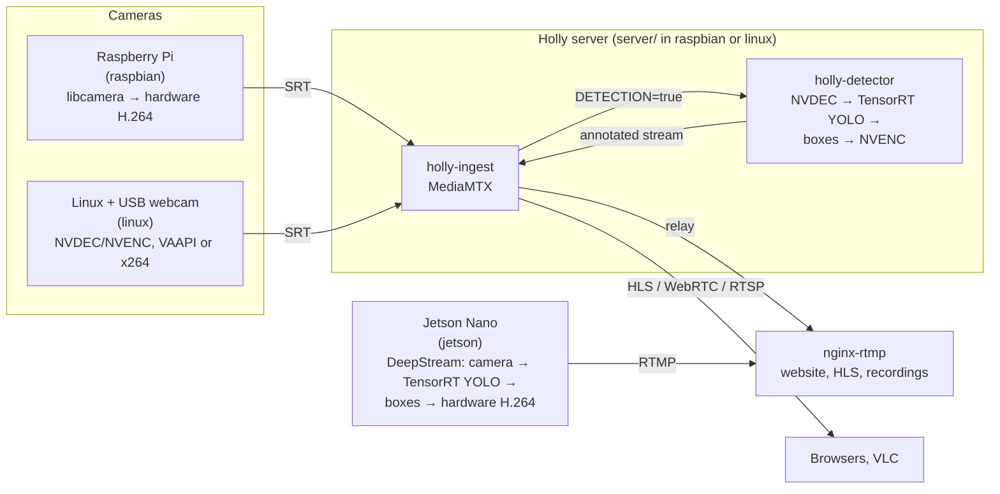

# Holly Stream


Live camera streams with real-time object detection drawn on every frame. Raspberry Pi cameras, USB webcams on
Linux machines and NVIDIA Jetsons stream to your server or website, with YOLO boxes (or, in December, Santa hats)
rendered by TensorRT on an NVIDIA GPU. With detection off, it works as a plain low-latency live camera that restarts
itself after errors.

**This branch holds no code.** Each hardware platform has its own branch with its own pipeline, README and setup
instructions. Pick one below.

## Choose your branch

| Branch | Runs on | Camera | Where detection runs | Output |
|---|---|---|---|---|
| [`raspbian`](https://github.com/rcland12/holly-stream/tree/raspbian) | Raspberry Pi 4 or 5 (camera), plus a Linux server with an NVIDIA GPU | Pi camera module (libcamera), optional USB mic | On the server's GPU | SRT to the Holly server, then HLS, WebRTC, RTSP and relay to nginx-rtmp |
| [`linux`](https://github.com/rcland12/holly-stream/tree/linux) | Any Linux machine with Docker (camera), plus a Linux server with an NVIDIA GPU (can be the same machine) | USB (UVC) webcam and its mic | On the server's GPU | SRT to the Holly server, then HLS, WebRTC, RTSP and relay to nginx-rtmp |
| [`jetson`](https://github.com/rcland12/holly-stream/tree/jetson) | NVIDIA Jetson Nano 4GB (JetPack 4.6.x) | CSI camera (IMX219), optional USB mic | On the Jetson itself (DeepStream) | RTMP to its own nginx web player or to a remote nginx-rtmp server |

```bash
git clone -b raspbian https://github.com/rcland12/holly-stream.git ~/dev/holly-stream   # Raspberry Pi camera, or the server
git clone -b linux    https://github.com/rcland12/holly-stream.git ~/dev/holly-stream   # USB webcam on Linux, or the server
git clone -b jetson   https://github.com/rcland12/holly-stream.git ~/dev/holly-stream   # Jetson Nano
```

Use `git@github.com:rcland12/holly-stream.git` to clone over SSH, then follow the README in that branch.
`~/dev/holly-stream` is where the multi-camera scripts look for a clone by default.

**Which one?** If you have a GPU server and inexpensive cameras, use `raspbian` or `linux`: the cameras only capture
and encode, and one server runs detection for all of them. If a camera has to work on its own, with nothing else on
the network, use `jetson`.

## How it fits together

There are two designs. Pi and Linux cameras send their video to a shared server that runs detection. A Jetson does
everything on the device.


```mermaid
flowchart LR
    subgraph Cameras["Cameras"]
        Pi["Raspberry Pi<br/>(raspbian)<br/>libcamera → hardware H.264"]
        Linux["Linux + USB webcam<br/>(linux)<br/>NVDEC/NVENC, VAAPI or x264"]
    end

    subgraph Server["Holly server (server/ in raspbian or linux)"]
        Ingest["holly-ingest<br/>MediaMTX"]
        Detector["holly-detector<br/>NVDEC → TensorRT YOLO →<br/>boxes → NVENC"]
    end

    Jetson["Jetson Nano<br/>(jetson)<br/>DeepStream: camera → TensorRT YOLO →<br/>boxes → hardware H.264"]

    Pi -- "SRT" --> Ingest
    Linux -- "SRT" --> Ingest
    Ingest -- "DETECTION=true" --> Detector
    Detector -- "annotated stream" --> Ingest
    Ingest -- "relay" --> Nginx["nginx-rtmp<br/>website, HLS, recordings"]
    Ingest -- "HLS / WebRTC / RTSP" --> Viewers["Browsers, VLC"]
    Jetson -- "RTMP" --> Nginx
```

- **Holly server** (`raspbian` and `linux` branches): `holly-ingest` receives every camera over SRT, serves it over
  HLS, WebRTC and RTSP, and can relay each one to an nginx-rtmp server. The optional `holly-detector` picks up
  cameras that set `DETECTION=true`, runs YOLO on every frame with TensorRT, and publishes an annotated copy. If the
  detector stops, those cameras fall back to their plain streams within seconds. Cameras can be added, moved or
  removed without changing anything on the server. The `linux` branch's server also has the optional Santa hat
  overlay.
- **Raspberry Pi camera** (`raspbian`): a systemd service running a GStreamer pipeline. The Pi's hardware encoder
  produces the H.264, and the Pi runs no Docker, Python or model.
- **Linux camera** (`linux`): one Docker container running FFmpeg. It picks the best encoder the machine has; on
  NVIDIA, decoding and encoding both stay on the GPU.
- **Jetson** (`jetson`): a small C program that builds a DeepStream pipeline. Frames stay in GPU memory from the
  camera through TensorRT to the hardware encoder.

## Performance

Each branch measured its own numbers; its README has the details.

| Setup | Detection | Model | Result |
|---|---|---|---|
| Raspberry Pi 4 → server (GTX 1660) | Every frame | YOLO26m 480x640 | 30 fps, ~10 ms inference per camera; four cameras hold 30 fps on YOLO26s |
| USB webcam on Linux → server (GTX 1660) | Every frame | YOLO26s 480x640 | 30 fps, ~5 ms inference; the camera uses ~0.4 of a CPU core |
| Jetson Nano 4GB | Every frame | YOLO26n 640x384 | 28 fps (the camera's limit), 41 ms from capture to encoded frame |

The previous versions of every branch ran detection on only some of the frames: the Jetson on every 10th frame
through Triton, the Pi on its own CPU at about 5 detections per second, and Linux on every 2nd to 6th frame through a
Python frame loop.

## Features

- **Object detection on every frame**: Ultralytics YOLO26, YOLO11 and YOLOv8 models, compiled to TensorRT FP16 on
  first start. Choose which classes to draw and the confidence threshold. The server steadies boxes between frames;
  the Jetson can track objects.
- **Custom models**: each branch documents collecting images from your own cameras, labeling, training and
  exporting.
- **Low-latency transport**: SRT retransmits packets lost on WiFi within a fixed latency window, and WebRTC viewing
  has under a second of delay.
- **Audio**: microphone audio encoded to AAC and kept in sync through detection.
- **Self-healing**: pipelines restart after errors, stalls, dropped connections and unplugged cameras, and never
  start on boot unless you started them.
- **Many cameras, one command**: `run-all-cameras.sh`, `stop-all-cameras.sh` and `status-all-cameras.sh` control
  every camera over SSH. The script is the same on every branch, so Pi, Linux and Jetson cameras share one list:

  ```
  rusty        ok: streaming  STREAM_NAME=hollystream6/hollyvideostream6 DETECTION=true
  rustypi6     ok: streaming  STREAM_NAME=hollystream4/hollyvideostream4 DETECTION=true ROTATION=0
  rustynano    ok: started
  ```

- **Extras**: training snapshots from live cameras, and a Santa hat overlay for the holidays (`linux` server).

## Requirements at a glance

- **Holly server** (`raspbian` or `linux`): Linux with Docker and the compose plugin. For detection: an NVIDIA GPU
  (Turing / GTX 16xx or newer), driver 560+ and the NVIDIA Container Toolkit.
- **Raspberry Pi camera** (`raspbian`): Raspberry Pi 4 or 5 on Raspberry Pi OS Bookworm or Trixie, a
  libcamera-supported camera module, and optionally a USB microphone.
- **Linux camera** (`linux`): Linux with Docker and a UVC webcam. An NVIDIA GPU (with the Container Toolkit) or an
  Intel/AMD GPU is optional and is used for encoding.
- **Jetson** (`jetson`): Jetson Nano 4GB with JetPack 4.6.x, a CSI camera, and Docker with the NVIDIA runtime as the
  default.

## Tested hardware

| Branch | Tested on |
|---|---|
| `raspbian` | Raspberry Pi 4 with OV5647, IMX519 (Arducam 16MP) and fisheye camera modules; server with a GTX 1660 |
| `linux` | Ubuntu 24.04 server with 4 cores and a GTX 1660, Logitech C922 Pro Stream Webcam |
| `jetson` | Jetson Nano 4GB, JetPack 4.6 (L4T R32.7), IMX219 camera |

## Technologies

- **Detection**: Ultralytics YOLO, ONNX, NVIDIA TensorRT, PyTorch (GPU preprocessing), NVIDIA DeepStream (Jetson)
- **Video**: GStreamer, FFmpeg and PyAV, NVDEC/NVENC, V4L2, libcamera
- **Streaming**: SRT, MediaMTX, RTMP, HLS, WebRTC, RTSP, nginx-rtmp
- **Deployment**: Docker and Docker Compose, systemd

## Branches

| Branch | Purpose |
|---|---|
| `master` | This overview, the license and the contributing guide |
| `raspbian`, `linux`, `jetson` | Stable version for each platform; clone these |
| `raspbian_develop`, `linux_develop`, `jetson_develop` | Work in progress, merged into the platform branch by pull request |

## Contributing

Contributions are welcome. See [CONTRIBUTING.md](CONTRIBUTING.md) for how the branches are organized, how to test on
each platform, and ideas for what to work on.

## License

MIT. See [LICENSE](LICENSE).

## Support

For bugs, questions or feature requests, open an issue on
[GitHub Issues](https://github.com/rcland12/holly-stream/issues) and say which branch and hardware you are using.
