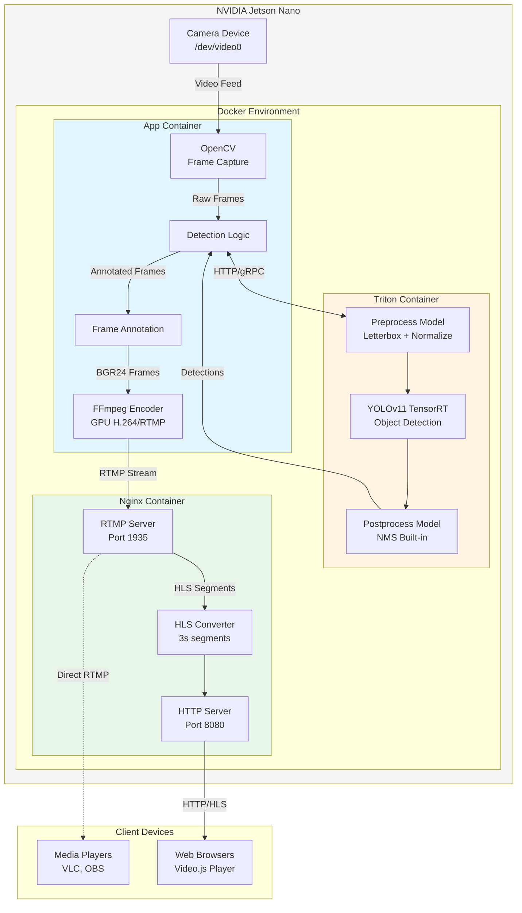

# Holly Stream


A containerized live streaming application for NVIDIA Jetson edge devices featuring real-time object detection, hardware-accelerated inference, and multi-protocol streaming capabilities. Built with YOLOv11, Triton Inference Server, and FFmpeg for high-performance video processing.

## Table of Contents

- [Overview](#overview)
- [Features](#features)
- [Architecture](#architecture)
- [System Requirements](#system-requirements)
- [Installation](#installation)
- [Configuration](#configuration)
- [Deployment Options](#deployment-options)
- [Advanced Configuration](#advanced-configuration)
- [Custom Model Training](#custom-model-training)
- [Application Flow](#application-flow)
- [Troubleshooting](#troubleshooting)

## Overview

Holly Stream transforms your NVIDIA Jetson Nano into a powerful streaming platform capable of:

- **Real-time Object Detection**: Using YOLOv11 models with TensorRT acceleration and Nvidia Triton Inference Server for optimized performance
- **Hardware-Accelerated Inference**: TensorRT-optimized models with FP16 precision for faster inference on Jetson GPU
- **Live Streaming**: Direct camera feed streaming with or without AI processing
- **Multi-Protocol Support**: Stream via RTMP to media players or HLS for web browsers
- **Flexible Deployment**: Local network, remote web server, or localhost streaming options

## Features

### Core Capabilities
- **Real-Time Object Detection**: 80 COCO object classes with YOLOv11 model
- **Hardware Acceleration**: TensorRT-optimized inference on Jetson GPU
- **Triton Inference Server**: Enterprise-grade model serving with ensemble pipeline
- **Multiple Streaming Protocols**: RTMP for publishing, HLS for web playback
- **Flexible Deployment**: Local, LAN, or WAN streaming configurations
- **Dual Operation Modes**: With or without object detection
- **Web-Based Playback**: Built-in HTML5 video player with Video.js
- **Audio Support**: Optional audio streaming with quality presets

### Performance Optimizations
- **Frame Skipping**: Inference every 10 frames for 3x performance improvement
- **GPU Video Encoding**: Hardware-accelerated H.264 encoding (nvv4l2h264enc)
- **FP16 Precision**: Half-precision TensorRT models for faster inference
- **Quality Presets**: Five streaming quality levels (ultra, high, smooth, balanced, fast)
- **Letterbox Preprocessing**: Maintains aspect ratio while minimizing model complexity

### Developer Features
- **Data Collection Tool**: Built-in utility for gathering training images
- **Model Conversion Pipeline**: ONNX to TensorRT conversion with NMS baking
- **Custom Model Support**: Easy integration of custom YOLOv5/YOLOv11 models
- **Docker Compose Orchestration**: Multi-container deployment with health checks
- **Environment-Based Configuration**: All parameters configurable via .env file

### Fun Extras
- **Santa Hat Plugin**: Festive easter egg that overlays a Santa hat on detected objects

## Architecture

### System Overview


```mermaid
flowchart TB
    subgraph JetsonNano["NVIDIA Jetson Nano"]
        Camera["Camera Device<br/>/dev/video0"]

        subgraph DockerEnv["Docker Environment"]
            subgraph AppContainer["App Container"]
                CameraCapture["OpenCV<br/>Frame Capture"]
                Detector["Detection Logic"]
                Annotator["Frame Annotation"]
                FFmpeg["FFmpeg Encoder<br/>GPU H.264/RTMP"]
            end

            subgraph TritonContainer["Triton Container"]
                Preprocess["Preprocess Model<br/>Letterbox + Normalize"]
                YOLOModel["YOLOv11 TensorRT<br/>Object Detection"]
                Postprocess["Postprocess Model<br/>NMS Built-in"]
            end

            subgraph NginxContainer["Nginx Container"]
                RTMPServer["RTMP Server<br/>Port 1935"]
                HLSConverter["HLS Converter<br/>3s segments"]
                WebServer["HTTP Server<br/>Port 8080"]
            end
        end
    end

    subgraph Clients["Client Devices"]
        MediaPlayer["Media Players<br/>VLC, OBS"]
        WebBrowser["Web Browsers<br/>Video.js Player"]
    end

    Camera -->|Video Feed| CameraCapture
    CameraCapture -->|Raw Frames| Detector
    Detector <-->|HTTP/gRPC| Preprocess
    Preprocess --> YOLOModel
    YOLOModel --> Postprocess
    Postprocess -->|Detections| Detector
    Detector -->|Annotated Frames| Annotator
    Annotator -->|BGR24 Frames| FFmpeg
    FFmpeg -->|RTMP Stream| RTMPServer
    RTMPServer -->|HLS Segments| HLSConverter
    HLSConverter --> WebServer
    RTMPServer -.->|Direct RTMP| MediaPlayer
    WebServer -->|HTTP/HLS| WebBrowser

    style AppContainer fill:#e1f5ff
    style TritonContainer fill:#fff4e1
    style NginxContainer fill:#e8f5e9
    style JetsonNano fill:#f5f5f5
```

### Data Flow

**Object Detection Mode:**

1. Camera captures frame at configured FPS (e.g., 30 FPS)
2. Every 10th frame sent to Triton Inference Server
3. Triton pipeline: Preprocess → TensorRT Detection (NMS built-in) → Results
4. Detection results returned to application
5. Frame annotated with bounding boxes and labels
6. All frames encoded with GPU-accelerated FFmpeg and streamed via RTMP
7. Nginx receives RTMP stream and converts to HLS
8. Clients connect via RTMP or HTTP/HLS

**Direct Streaming Mode:**

1. Camera feed captured by OpenCV
2. Frames encoded directly with FFmpeg (no AI processing)
3. GPU-accelerated H.264 encoding with minimal latency
4. RTMP output to nginx server
5. No processing overhead

## System Requirements

### Hardware

- **NVIDIA Jetson Nano** (or Jetson Xavier NX, Jetson TX2)
- **JetPack 4.6.1** (Ubuntu 18.04, L4T r32.7.1)
- **Minimum 4GB RAM** (8GB recommended for Jetson Xavier NX)
- **Camera**: 720p minimum, 1080p recommended
  - USB Webcam (V4L2 compatible)
  - CSI Camera Module
- **Storage**: 10GB+ free space for Docker images and recordings
- **Network**: Ethernet or WiFi connection
- **Optional**: PWM fan for cooling during intensive workloads

### Software

- **Operating System**: JetPack 4.6.1 or later
- **Docker**: Version 20.10 or later with NVIDIA Container Runtime
- **docker-compose**: 1.27.4 or higher
- **CUDA** and **cuDNN** (bundled with JetPack)
- **TensorRT** (bundled with Triton container)

### Optional Requirements

- **For Object Detection**: TensorRT-compatible ONNX models
- **For Custom Models**: CUDA-enabled machine for training (not required for inference)
- **For WAN Streaming**: Public IP address or domain, port forwarding configured

## Installation

### 1. Clone Repository

```bash
git clone https://github.com/yourusername/holly-stream.git
cd holly-stream
```

### 2. Allocate Swap Memory (Recommended)

Swap memory uses storage when physical RAM is exhausted. Highly recommended for Jetson Nano with 4GB RAM.

```bash
sudo fallocate -l 4G /var/swapfile
sudo chmod 600 /var/swapfile
sudo mkswap /var/swapfile
sudo swapon /var/swapfile
sudo bash -c "echo '/var/swapfile swap swap defaults 0 0' >> /etc/fstab"
```

Verify swap is active:
```bash
free -h
```

### 3. Configure Docker for GPU Access (Required)

Add NVIDIA runtime as default to `/etc/docker/daemon.json`:

```json
{
    "runtimes": {
        "nvidia": {
            "path": "nvidia-container-runtime",
            "runtimeArgs": []
        }
    },
    "default-runtime": "nvidia"
}
```

Restart Docker daemon:
```bash
sudo systemctl restart docker
```

Verify GPU access:
```bash
docker run --rm --runtime=nvidia nvcr.io/nvidia/l4t-base:r32.7.1 nvidia-smi
```

### 4. Install Docker Compose (Required)

Install on system Python (not in virtual environment):

```bash
pip3 install --upgrade pip
pip3 install docker-compose==1.27.4
```

Verify installation:
```bash
docker-compose version
# Expected output: docker-compose version 1.27.4
```

### 5. Pull Docker Images

Pull the pre-built container images from Docker Hub:

```bash
# App container with OpenCV, PyTorch, and Triton client
docker pull rcland12/detection-stream:jetson-latest

# Triton inference server with TensorRT backend
docker pull rcland12/detection-stream:jetson-triton-latest

# NGINX with RTMP module for streaming
docker pull rcland12/detection-stream:nginx-latest
```

### 6. Camera Setup

**For USB Webcam:**

- Connect camera to USB port
- Verify device: `ls /dev/video*`
- Note device number (usually `/dev/video0`)
- Test camera: `v4l2-ctl --list-devices`

**For CSI Camera:**

- Ensure camera is properly connected to CSI port
- Verify with: `gst-launch-1.0 nvarguscamerasrc ! nvoverlaysink`

### Alternative: Bare-Metal Installation

For advanced users who want to build from source. This process takes 2-3 hours and requires multiple sudo password prompts.

**WARNING**: Only tested on Jetson Nano with JetPack 4.6.1 (Ubuntu 18.04).

```bash
chmod +x install.sh
./install.sh
```

The script installs:
- OpenCV 4.5.1 (with CUDA, cuDNN, GStreamer support)
- PyTorch 1.8.0 (NVIDIA ARM64 wheel)
- Torchvision 0.9.0
- Triton Inference Server 2.16.0
- Triton Python Client
- Additional Python packages (numpy, imutils, python-dotenv, etc.)

## Configuration

### Environment Variables

Create a `.env` file in the project root directory. This file controls all operational parameters.

**Create Configuration File:**

```bash
touch .env
```

### Configuration Parameters

Below are all available parameters with their default values:

```bash
# Object Detection Settings
OBJECT_DETECTION=True              # Enable/disable object detection (True/False)
MODEL_NAME=yolo11                  # Triton model name
TRITON_URL=http://triton:8000      # Triton server URL

# Streaming Settings
STREAM_IP=127.0.0.1                # Destination IP for RTMP stream
STREAM_PORT=1935                   # RTMP port
STREAM_APPLICATION=live            # RTMP application name
STREAM_KEY=stream                  # RTMP stream key

# Camera Settings
CAMERA_INDEX=0                     # Camera device index (/dev/video0)
CAMERA_WIDTH=1280                  # Capture width in pixels
CAMERA_HEIGHT=720                  # Capture height in pixels
CAMERA_FPS=30                      # Frames per second

# Optional Features
SANTA_HAT_PLUGIN=False             # Enable Santa hat overlay (True/False)
AUDIO_ENABLED=False                # Enable audio streaming (True/False)
AUDIO_DEVICE=hw:2,0                # ALSA audio device
STREAM_QUALITY=smooth              # Quality preset (ultra/high/smooth/balanced/fast)
```

### Parameter Details

**OBJECT_DETECTION**
- Set to `False` to run a simple camera stream without AI inference
- Reduces CPU/GPU usage significantly
- Falls back to GStreamer-based streaming via `stream.sh`

**MODEL_NAME**
- Default: `yolo11` (YOLOv11 medium model with 80 COCO classes)
- Can be replaced with custom YOLOv5/YOLOv11 models (see [Custom Model Training](#custom-model-training))

**STREAM_IP**
- `127.0.0.1`: Stream to same device (localhost)
- `192.168.x.x`: Stream to another device on LAN (find with `ip a` on Linux or `ipconfig` on Windows)
- Public IP: Stream to remote server (requires port forwarding)

**STREAM_QUALITY** (only used when OBJECT_DETECTION=False)
- `ultra`: 12 Mbps, maximum quality
- `high`: 8 Mbps, excellent quality
- `smooth`: 6 Mbps, stable streaming (default)
- `balanced`: 5 Mbps, good quality/performance balance
- `fast`: 4 Mbps, optimized for performance

**SANTA_HAT_PLUGIN**
- When enabled, places a Santa hat PNG overlay on the highest-confidence detection
- Replaces bounding box annotation with festive hat image
- Useful for custom single-object models (e.g., pet detection)

## Deployment Options

### Option 1: Local Streaming to Web Browser

Stream to web browsers on the same device or local network using HLS protocol.

**Step 1: Create Configuration File**

```bash
touch .env
```

**Step 2: Configure Environment**

Update `.env` for basic object detection:

```bash
OBJECT_DETECTION=True
STREAM_IP=127.0.0.1
STREAM_PORT=1935
STREAM_APPLICATION=live
STREAM_KEY=stream
```

**Step 3: Start Services**

```bash
# Start Holly Stream
./run.sh

# Start NGINX web server
docker compose up -d nginx-web
```

**Step 4: Access Stream**

Open browser and navigate to:
```
http://localhost:8080
```

Or from another device on your network:
```
http://<JETSON_IP>:8080
```

**Step 5: Stop Services**

```bash
./stop.sh
docker compose down
```

The script will:
- Start Triton server and wait for health check (if OBJECT_DETECTION=True)
- Start app container
- Set PWM fan to maximum speed
- Monitor container health

### Option 2: Local Streaming to Media Player

Stream to VLC, OBS, or other RTMP-compatible software on the same device or local network.

**Step 1: Start Nginx Server**

```bash
docker compose up -d nginx-stream
```

**Step 2: Configure Environment**

Update `.env`:

```bash
OBJECT_DETECTION=True  # or False for direct streaming
STREAM_IP=127.0.0.1   # for same device, or LAN IP for other devices
STREAM_PORT=1935
STREAM_APPLICATION=live
STREAM_KEY=stream
```

**Step 3: Start Streaming**

```bash
./run.sh
```

**Step 4: Connect Media Player**

Open network stream in your media player:

- **Same device**: `rtmp://localhost:1935/live/stream`
- **LAN device**: `rtmp://192.168.1.100:1935/live/stream` (use Jetson's IP)

**In VLC Media Player:**
1. Media > Open Network Stream
2. Enter URL: `rtmp://<JETSON_IP>:1935/live/stream`
3. Click Play

**In OBS Studio:**
1. Add Source > Media Source
2. Uncheck "Local File"
3. Input: `rtmp://<JETSON_IP>:1935/live/stream`
4. Click OK

**Step 5: Stop Services**

```bash
./stop.sh
docker compose down
```

### Option 3: Remote Web Server Streaming (WAN)

Stream from Jetson to a public web server accessible over the internet.

**Prerequisites:**

- Web server with Docker installed
- Domain name or public IP address
- Port 1935 open in firewall for RTMP

**On Web Server:**

**Step 1: Clone Repository**

```bash
ssh user@your-server.com
git clone https://github.com/yourusername/holly-stream.git
cd holly-stream
```

**Step 2: Configure Nginx**

Edit `nginx/nginx.conf`:

**Line 27** - Add your domain:

```nginx
server_name your-domain.com;  # Replace localhost
```

**Lines 40-43** - Whitelist your home IP:

```nginx
# Find your IP at https://whatismyipaddress.com/
allow publish 203.0.113.45;  # Your home IP address
allow publish 127.0.0.0/8;   # Keep for local testing
```

**Line 46** (optional) - Change application name:

```nginx
application live {  # Change "live" to custom name if desired
    # ...
}
```

Edit `nginx/stream/index.html`:

**Replace all instances** of `http://localhost` with your domain:

```html
<!-- Before -->
src: 'http://localhost/hls/stream.m3u8'

<!-- After -->
src: 'https://your-domain.com/hls/stream.m3u8'
```

**Line 20** - Replace stream key for security:

```html
<!-- Before -->
src: 'http://localhost/hls/stream.m3u8'

<!-- After -->
src: 'https://your-domain.com/hls/mySecureKey123.m3u8'
```

**Step 3: Start Nginx**

```bash
docker compose up -d nginx-web
```

**On Jetson Device:**

**Step 1: Update Configuration**

Update `.env`:

```bash
OBJECT_DETECTION=True
STREAM_IP=203.0.113.10  # Your web server's public IP
STREAM_PORT=1935
STREAM_APPLICATION=live
STREAM_KEY=mySecureKey123  # Match the key in index.html
```

**Step 2: Start Streaming**

```bash
./run.sh
```

**Step 3: Access Stream**

Navigate to:

```
https://your-domain.com/index.html
```

**Security Notes:**

- Use HTTPS with SSL certificates (Let's Encrypt recommended)
- Keep stream keys private
- Whitelist only trusted IP addresses
- Consider additional authentication for production

### Monitoring and Control

**View Application Logs:**

```bash
docker compose logs -f app
```

**View Triton Logs:**

```bash
docker compose logs -f triton
```

**Check Container Status:**

```bash
docker compose ps
```

**Check Triton Health:**

```bash
curl http://localhost:8000/v2/health/ready
```

## Advanced Configuration

### Configuration Examples

**Example 1: Basic Object Detection Stream**

Detect all 80 COCO classes and stream to localhost.

**.env:**
```bash
OBJECT_DETECTION=True
MODEL_NAME=yolo11
STREAM_IP=127.0.0.1
```

```bash
./run.sh
docker compose up -d nginx-web
# Open browser: http://localhost:8080
```

**Example 2: Simple Camera Stream (No AI)**

Stream raw camera feed without object detection.

**.env:**
```bash
OBJECT_DETECTION=False
STREAM_IP=127.0.0.1
STREAM_QUALITY=high
AUDIO_ENABLED=True
AUDIO_DEVICE=hw:2,0
```

```bash
./run.sh
docker compose up -d nginx-web
```

**Example 3: Custom Classes Detection**

Detect only people, dogs, and cars.

**.env:**
```bash
OBJECT_DETECTION=True
CLASSES=[0, 2, 16]  # person, car, dog
STREAM_IP=192.168.1.100
```

Refer to [COCO Classes Reference](#coco-classes-reference) for class indices.

**Example 4: High-Resolution Stream**

Stream at 1920x1080 resolution.

**.env:**
```bash
CAMERA_WIDTH=1920
CAMERA_HEIGHT=1080
CAMERA_FPS=30
STREAM_IP=127.0.0.1
```

Note: Higher resolution increases CPU/GPU load and may reduce frame rate.

**Example 5: Pet Monitoring with Santa Hat**

Detect your pet with festive Santa hat overlay.

**.env:**
```bash
OBJECT_DETECTION=True
MODEL_NAME=custom_pet_model  # Your custom trained model
SANTA_HAT_PLUGIN=True
STREAM_IP=127.0.0.1
```

### Supported Object Classes

The default YOLOv11 model detects 80 COCO classes. To filter classes, add `CLASSES=[index1, index2, ...]` to your `.env` file.

| Index | Class Name      | Index | Class Name       | Index | Class Name        | Index | Class Name      |
|-------|----------------|-------|------------------|-------|-------------------|-------|-----------------|
| 0     | person         | 20    | elephant         | 40    | wine glass        | 60    | dining table    |
| 1     | bicycle        | 21    | bear             | 41    | cup               | 61    | toilet          |
| 2     | car            | 22    | zebra            | 42    | fork              | 62    | tv              |
| 3     | motorcycle     | 23    | giraffe          | 43    | knife             | 63    | laptop          |
| 4     | airplane       | 24    | backpack         | 44    | spoon             | 64    | mouse           |
| 5     | bus            | 25    | umbrella         | 45    | bowl              | 65    | remote          |
| 6     | train          | 26    | handbag          | 46    | banana            | 66    | keyboard        |
| 7     | truck          | 27    | tie              | 47    | apple             | 67    | cell phone      |
| 8     | boat           | 28    | suitcase         | 48    | sandwich          | 68    | microwave       |
| 9     | traffic light  | 29    | frisbee          | 49    | orange            | 69    | oven            |
| 10    | fire hydrant   | 30    | skis             | 50    | broccoli          | 70    | toaster         |
| 11    | stop sign      | 31    | snowboard        | 51    | carrot            | 71    | sink            |
| 12    | parking meter  | 32    | sports ball      | 52    | hot dog           | 72    | refrigerator    |
| 13    | bench          | 33    | kite             | 53    | pizza             | 73    | book            |
| 14    | bird           | 34    | baseball bat     | 54    | donut             | 74    | clock           |
| 15    | cat            | 35    | baseball glove   | 55    | cake              | 75    | vase            |
| 16    | dog            | 36    | skateboard       | 56    | chair             | 76    | scissors        |
| 17    | horse          | 37    | surfboard        | 57    | couch             | 77    | teddy bear      |
| 18    | sheep          | 38    | tennis racket    | 58    | potted plant      | 78    | hair dryer      |
| 19    | cow            | 39    | bottle           | 59    | bed               | 79    | toothbrush      |

**Example: Detect Only Vehicles**

```bash
CLASSES=[1, 2, 3, 5, 6, 7, 8]  # bicycle, car, motorcycle, bus, train, truck, boat
```

## Custom Model Training

The repository includes the default YOLOv11 medium model trained on 80 COCO classes. To use a custom model:

### Prerequisites
- Custom model trained with YOLOv5 or YOLOv11
- CUDA-enabled machine for training (recommended)
- Basic understanding of YOLO training workflow

### Training Workflow

#### 1. Gather Training Data

Use the built-in data collection script:

```bash
cd app
python3 collect_data.py
```

This will:
- Capture frames from camera every 2 seconds
- Save images as `pic_0.png`, `pic_1.png`, etc.
- Save to current directory
- Capture 100 images by default

#### 2. Annotate Data

Use [Roboflow](https://roboflow.com/) or similar annotation tool:
- Create project with YOLO format export
- Upload collected images
- Draw bounding boxes around objects
- Label each object
- Use 70/30 train/validation split
- Export in YOLOv5 format

#### 3. Train Model

Train on CUDA-enabled machine using YOLOv5 repository:

```bash
git clone https://github.com/ultralytics/yolov5.git
cd yolov5
pip install -r requirements.txt

python train.py \
  --weights yolov5s.pt \
  --cfg yolov5s.yaml \
  --data /path/to/data.yaml \
  --epochs 1000 \
  --batch-size 16 \
  --optimizer AdamW \
  --device 0
```

Best weights will be saved to `runs/train/exp/weights/best.pt`.

#### 4. Export to ONNX

Export with FP16 precision and opset 15 for Jetson compatibility:

```bash
python export.py \
  --include onnx \
  --weights runs/train/exp/weights/best.pt \
  --half \
  --opset 15 \
  --device 0
```

This creates `best.onnx` in the same directory.

#### 5. Transfer to Jetson

Copy ONNX model to Jetson:

```bash
scp runs/train/exp/weights/best.onnx jetson@192.168.1.100:~/
```

#### 6. Convert to TensorRT

On Jetson device, use the conversion script:

```bash
cd holly-stream/triton

# Option A: Use automated conversion script
./convert.sh /path/to/best.onnx

# Option B: Manual conversion with convert.py
python3 convert.py --input /path/to/best.onnx --output model_nms.onnx

# Then compile to TensorRT
/usr/src/tensorrt/bin/trtexec \
  --onnx=model_nms.onnx \
  --saveEngine=model.plan \
  --explicitBatch \
  --fp16 \
  --inputIOFormats=fp16:chw \
  --outputIOFormats=fp16:chw
```

#### 7. Deploy Model

Move TensorRT engine to model repository:

```bash
mv model.plan triton/object_detection/1/model.plan
```

Update `.env`:
```bash
MODEL_NAME=yolo11
```

Note: If using custom ensemble model, update `MODEL_NAME` to match your model directory in `triton/`.

#### 8. Test Model

Use the test script:

```bash
cd triton
python3 test.py
```

This will:
- Load test image from `app/images/image_1280_720.png`
- Run inference through Triton
- Save annotated result to `results.png`

### Model Conversion Details

The `convert.py` script:
- Loads ONNX model with ONNX GraphSurgeon
- Identifies YOLO decoder output nodes
- Removes PyTorch NMS operations
- Inserts TensorRT EfficientNMS plugin
- Saves optimized ONNX graph

NMS parameters (configurable in script):
- `keep_topk`: 100 (maximum detections to keep)
- `score_threshold`: 0.5 (minimum confidence)
- `iou_threshold`: 0.45 (IoU threshold for NMS)

## Application Flow

The following flowchart illustrates the complete data pipeline from camera input to web playback:


```mermaid
flowchart TB
    Start([Start Holly Stream]) --> CheckMode{Object Detection<br/>Enabled?}

    CheckMode -->|Yes| StartTriton[Start Triton Server]
    CheckMode -->|No| StartApp[Start App Container]

    StartTriton --> WaitHealth[Wait for Health Check]
    WaitHealth --> StartApp

    StartApp --> InitCamera[Initialize Camera<br/>1280x720 @ 30fps]
    InitCamera --> InitFFmpeg[Initialize FFmpeg Process<br/>RTMP Output]
    InitFFmpeg --> MainLoop[Main Processing Loop]

    MainLoop --> CaptureFrame[Capture Frame from Camera]
    CaptureFrame --> CheckInterval{Frame Count<br/>% 10 == 0?}

    CheckInterval -->|Yes| PrepareInput[Prepare Input Image<br/>720x1280x3 uint8]
    CheckInterval -->|No| SkipDetection[Use Previous Detections]

    PrepareInput --> TritonPreprocess[Triton: Preprocess Model<br/>Letterbox Resize to 640x640<br/>Normalize & Transpose]
    TritonPreprocess --> TritonDetection[Triton: TensorRT Detection<br/>YOLOv11 Forward Pass<br/>NMS Built-in]
    TritonDetection --> ParseOutputs[Parse NMS Outputs<br/>num_dets, boxes, scores, classes]
    ParseOutputs --> RescaleBoxes[Rescale Boxes<br/>Remove padding<br/>Scale to 1280x720]

    RescaleBoxes --> CheckDetections{Detections<br/>Found?}
    SkipDetection --> CheckDetections

    CheckDetections -->|Yes| Annotate[Annotate Frame<br/>Draw Bounding Boxes<br/>Add Labels & Confidence]
    CheckDetections -->|No| SkipAnnotate[No Annotation]

    Annotate --> EncodeFrame[Write Frame to FFmpeg stdin<br/>Raw BGR24 bytes]
    SkipAnnotate --> EncodeFrame

    EncodeFrame --> FFmpegEncode[FFmpeg: H.264 Encoding<br/>ultrafast preset<br/>FLV container]
    FFmpegEncode --> RTMPPublish[Publish to RTMP<br/>rtmp://nginx:1935/live/stream]

    RTMPPublish --> NGINXReceive[NGINX: Receive RTMP Stream]
    NGINXReceive --> HLSConvert[NGINX: Convert to HLS<br/>3-second segments<br/>Generate .m3u8 playlist]

    HLSConvert --> ServeWeb[Serve Web Interface<br/>http://localhost:8080]
    ServeWeb --> ClientAccess[Client: Video.js Player<br/>Plays HLS Stream]

    ClientAccess --> CheckContinue{Continue<br/>Streaming?}
    CheckContinue -->|Yes| MainLoop
    CheckContinue -->|No| Cleanup[Cleanup Resources<br/>Release Camera<br/>Stop Containers]

    Cleanup --> End([End])

    style Start fill:#e1f5e1
    style End fill:#ffe1e1
    style TritonPreprocess fill:#e3f2fd
    style TritonDetection fill:#e3f2fd
    style CheckMode fill:#fff3e0
    style CheckInterval fill:#fff3e0
    style CheckDetections fill:#fff3e0
    style CheckContinue fill:#fff3e0
```

### Pipeline Stages Explained

1. **Initialization**
   - Check if object detection is enabled in .env
   - Start Triton server if needed and wait for health check
   - Initialize camera, FFmpeg subprocess, and Triton client

2. **Capture & Detection** (every 10 frames)
   - Capture frame from camera device
   - Send frame to Triton ensemble model
   - Preprocessing: Letterbox resize, normalize to [0,1], transpose to CHW
   - Detection: TensorRT inference with NMS outputs (max 100 detections)
   - Parse results: num_dets, boxes [x1,y1,x2,y2], scores, class_ids

3. **Annotation**
   - Rescale bounding boxes from 640x640 model space to 1280x720 camera space
   - Draw colored rectangles and class labels on frame
   - Cache detections for next 9 frames (frame skipping optimization)

4. **Encoding & Streaming**
   - Write annotated frame to FFmpeg stdin as raw BGR24 bytes
   - FFmpeg encodes with GPU-accelerated H.264 (ultrafast preset for low latency)
   - Publish encoded stream to NGINX via RTMP protocol

5. **Distribution**
   - NGINX receives RTMP stream
   - Converts to HLS with 3-second segments
   - Serves .m3u8 playlist and .ts segment files
   - Clients access via web browser with Video.js player

## Troubleshooting

### Triton Server Fails to Start

**Symptoms:**
- `run.sh` times out after 60 seconds
- Error: "Triton failed all health checks"

**Solutions:**
1. Check GPU memory availability:
   ```bash
   tegrastats
   ```
2. Verify model files exist:
   ```bash
   ls -R triton/
   # Should see: object_detection/1/model.plan, preprocess/1/model.py, yolo11/config.pbtxt
   ```
3. Check Triton logs:
   ```bash
   docker compose logs triton
   ```
4. Restart with cleanup:
   ```bash
   ./stop.sh
   docker system prune -f
   ./run.sh
   ```

### No Camera Detected

**Symptoms:**
- Error: "Cannot open /dev/video0"
- App container exits immediately

**Solutions:**
1. List available cameras:
   ```bash
   ls /dev/video*
   ```
2. Test camera directly:
   ```bash
   v4l2-ctl --list-devices
   ```
3. Update `.env` with correct camera index:
   ```bash
   CAMERA_INDEX=1  # If camera is /dev/video1
   ```
4. Check camera permissions:
   ```bash
   sudo chmod 666 /dev/video0
   ```

### Stream Not Appearing in Browser

**Symptoms:**
- Web page loads but video player shows black screen
- "No compatible source was found for this media"

**Solutions:**
1. Wait 10-15 seconds for HLS segments to generate
2. Check NGINX logs:
   ```bash
   docker compose logs nginx-web
   ```
3. Verify RTMP stream is reaching NGINX:
   ```bash
   docker compose logs -f app | grep "rtmp"
   ```
4. Check HLS playlist is being created:
   ```bash
   docker exec holly-stream-nginx-web ls -lh /var/www/html/stream/hls/
   ```
5. Try alternative URL:
   - If `http://localhost:8080` fails, try `http://0.0.0.0:8080`

### Poor Performance / Low FPS

**Symptoms:**
- Stream is choppy or laggy
- Frame rate drops below 10 FPS

**Solutions:**
1. Reduce camera resolution:
   ```bash
   CAMERA_WIDTH=640
   CAMERA_HEIGHT=480
   CAMERA_FPS=15
   ```
2. Increase frame skip interval in `app/main.py`:
   ```python
   period = 20  # Inference every 20 frames instead of 10
   ```
3. Disable object detection:
   ```bash
   OBJECT_DETECTION=False
   ```
4. Use lower quality preset:
   ```bash
   STREAM_QUALITY=fast
   ```
5. Monitor system resources:
   ```bash
   tegrastats
   # Watch GPU utilization, RAM usage, temperature
   ```

### Audio Not Working

**Symptoms:**
- Video works but no audio
- Error: "Audio device not found"

**Solutions:**
1. List audio devices:
   ```bash
   arecord -l
   ```
2. Update `.env` with correct device:
   ```bash
   AUDIO_DEVICE=hw:3,0  # Use device from arecord output
   ```
3. Test audio device:
   ```bash
   arecord -D hw:3,0 -f cd -d 5 test.wav
   aplay test.wav
   ```
4. Check container has audio access:
   ```bash
   docker exec holly-stream-app ls -l /dev/snd/
   ```

### Docker Permission Errors

**Symptoms:**
- "Permission denied" when running Docker commands

**Solutions:**
1. Add user to docker group:
   ```bash
   sudo usermod -aG docker $USER
   newgrp docker
   ```
2. Verify group membership:
   ```bash
   groups
   # Should include 'docker'
   ```

### High GPU Temperature

**Symptoms:**
- Temperature exceeds 80°C
- System throttles performance

**Solutions:**
1. Verify fan is running:
   ```bash
   cat /sys/devices/pwm-fan/target_pwm
   # Should output 255 when run.sh is active
   ```
2. Improve cooling:
   - Attach heatsink to Jetson module
   - Use external fan
   - Improve airflow around device
3. Reduce workload:
   - Lower camera resolution
   - Increase frame skip interval
   - Use smaller YOLO model (yolov5n instead of yolov5m)

### Multi-Camera Setup

Deploy holly-stream on multiple Jetson devices simultaneously using SSH orchestration.

**Setup:**

1. Configure SSH key authentication for each Jetson device:
   ```bash
   ssh-copy-id jetson1@192.168.1.101
   ssh-copy-id jetson2@192.168.1.102
   ```

2. Edit `run-all-cameras.sh` with your device IPs and paths:
   ```bash
   JETSON_DEVICES=(
       "jetson1@192.168.1.101:/home/jetson1/holly-stream"
       "jetson2@192.168.1.102:/home/jetson2/holly-stream"
   )
   ```

3. Start all cameras:
   ```bash
   ./run-all-cameras.sh
   ```

4. Stop all cameras:
   ```bash
   ./stop-all-cameras.sh
   ```

### Custom Ensemble Models

Modify the Triton ensemble to add custom pre/post-processing stages.

**Example: Add Image Augmentation**

1. Create new model directory:
   ```bash
   mkdir -p triton/augmentation/1
   ```

2. Create `triton/augmentation/1/model.py`:
   ```python
   import triton_python_backend_utils as pb_utils
   import numpy as np

   class TritonPythonModel:
       def execute(self, requests):
           # Your augmentation logic here
           pass
   ```

3. Create `triton/augmentation/config.pbtxt`:
   ```
   name: "augmentation"
   backend: "python"
   input [{ name: "input_image", data_type: TYPE_UINT8, dims: [-1, -1, 3] }]
   output [{ name: "augmented_image", data_type: TYPE_UINT8, dims: [-1, -1, 3] }]
   ```

4. Update `triton/yolo11/config.pbtxt` ensemble to include augmentation step.

### Publishing Docker Images

Build and publish custom images to Docker Hub:

```bash
# Login to Docker Hub
docker login

# Build images
docker compose build

# Tag images
docker tag holly-stream-app:latest yourusername/detection-stream:jetson-latest
docker tag holly-stream-triton:latest yourusername/detection-stream:jetson-triton-latest

# Push to registry
docker push yourusername/detection-stream:jetson-latest
docker push yourusername/detection-stream:jetson-triton-latest

# Or use the automated script
./docker-push.sh
```

### Performance Profiling

Benchmark inference speed with Triton's `perf_analyzer`:

```bash
docker exec holly-stream-triton /opt/tritonserver/bin/perf_analyzer \
  -m yolo11 \
  -u localhost:8000 \
  --concurrency-range 1:4 \
  --shape image:1,1280,720,3 \
  --percentile=95
```

This will output:
- Inference throughput (inferences/second)
- Latency statistics (p50, p95, p99)
- Server vs. client latency breakdown

### GStreamer Direct Streaming

For scenarios without object detection, `stream.sh` provides a lightweight GStreamer pipeline:

```bash
# Enable in .env
OBJECT_DETECTION=False
STREAM_QUALITY=high
AUDIO_ENABLED=True

# Start streaming
./run.sh
```

Benefits:
- No Python overhead
- Lower latency
- Reduced CPU usage
- Hardware-accelerated encoding (nvv4l2h264enc)

## Repository Structure

```
holly-stream/
├── app/                        # Main application
│   ├── main.py                 # Object detection pipeline
│   ├── collect_data.py         # Training data collection
│   ├── stream.sh               # GStreamer streaming script
│   ├── entrypoint.sh           # Container entry point
│   ├── Dockerfile              # App container image
│   └── images/                 # Assets (logo, santa hat, test images)
│
├── triton/                     # Inference server
│   ├── yolo11/                 # Ensemble model
│   ├── object_detection/       # TensorRT model
│   ├── preprocess/             # Python preprocessing
│   ├── convert.py              # ONNX to TensorRT converter
│   ├── convert.sh              # Conversion workflow
│   ├── test.py                 # Model testing utility
│   └── Dockerfile              # Triton server image
│
├── nginx/                      # Web server
│   ├── nginx.conf              # Server configuration
│   ├── stream/                 # Web interface
│   │   ├── index.html          # Video.js player
│   │   └── hls/                # HLS segments directory
│   └── Dockerfile              # NGINX with RTMP module
│
├── docker-compose.yml          # Service orchestration
├── run.sh                      # Startup script
├── stop.sh                     # Shutdown script
├── run-all-cameras.sh          # Multi-device orchestration
├── stop-all-cameras.sh         # Multi-device shutdown
├── install.sh                  # Bare-metal installation
├── docker-push.sh              # Docker registry publishing
└── README.md                   # This file
```

## License

This project is licensed under the MIT License. See LICENSE file for details.

---

## Contributing

Contributions are welcome! Please submit pull requests or open issues for bugs and feature requests.

---

## Acknowledgments

- [Ultralytics YOLOv11](https://github.com/ultralytics/ultralytics) - Object detection framework
- [Nvidia Triton Inference Server](https://github.com/triton-inference-server/server) - Model serving
- [FFmpeg](https://ffmpeg.org/) - Video encoding
- [Nginx RTMP Module](https://github.com/arut/nginx-rtmp-module) - Streaming server
- [Video.js](https://videojs.com/) - HTML5 video player
- NVIDIA for Jetson platform and TensorRT

---

## Support

For questions, issues, or feature requests:

- Open an issue on GitHub
- Check existing documentation
- Review troubleshooting section above

