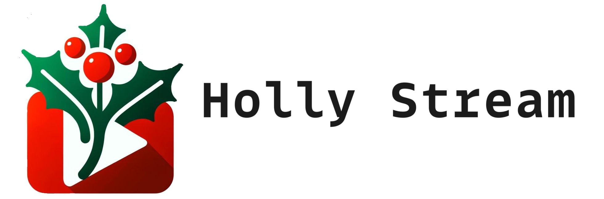

# Holly Stream



A real-time video streaming application with integrated AI-powered object detection. Stream your webcam feed with live bounding box detection via RTMP/HLS protocols to media players, web browsers, or remote servers.

---

## Overview

Holly Stream captures video from your camera, applies YOLO-based object detection with visual bounding boxes, and streams the processed feed in real-time. The application can also function as a simple live stream camera when object detection is disabled, making it ideal for security systems, monitoring applications, and AI-powered surveillance.

## Key Features

- **Real-time Object Detection**: YOLOv5/v11 models with 80 COCO dataset classes
- **GPU Acceleration**: Optimized for NVIDIA Jetson and CUDA-enabled devices using TensorRT
- **Flexible Streaming**: RTMP protocol for media players and HLS for web browsers
- **Customizable Detection**: Configurable classes, confidence thresholds, and detection parameters
- **Multiple Deployment Options**: Local, LAN, or remote web server streaming
- **Docker Support**: Fully containerized with Docker Compose orchestration
- **Multi-Platform**: Dedicated branches for Jetson, Linux, and Raspberry Pi architectures
- **Custom Model Support**: Train and deploy your own YOLOv5 models

## Use Cases

- Home security and surveillance systems
- Wildlife monitoring and detection
- Smart doorbell and entry monitoring
- Pet detection and tracking
- Traffic and parking monitoring
- Custom object detection applications

## Requirements

- Docker and Docker Compose
- NVIDIA GPU (for GPU-accelerated inference)
- Webcam or CSI camera
- 4GB+ RAM (8GB recommended for Jetson devices)

## Platform-Specific Branches

This project maintains three platform-optimized branches, each tailored for specific hardware architectures:

| Branch | Platform | Tested Hardware | Camera Support |
|--------|----------|----------------|----------------|
| [`jetson`](https://github.com/rcland12/holly-stream/tree/jetson) | NVIDIA Jetson | Jetson Nano (JetPack 4.6.4) | CSI (IMX219-160 8MP) |
| [`linux`](https://github.com/rcland12/holly-stream/tree/linux) | Linux x86_64 | Ubuntu 22.04 + GTX 1060 6GB | USB (Logitech 1080p) |
| [`raspbian`](https://github.com/rcland12/holly-stream/tree/raspbian) | Raspberry Pi | Raspberry Pi 4 (Debian Bookworm) | CSI (IMX519 16MP) |

### Getting Started

Clone the branch corresponding to your target platform:

**For NVIDIA Jetson Devices:**
```bash
# HTTPS
git clone --branch jetson --depth 1 https://github.com/rcland12/holly-stream.git

# SSH
git clone --branch jetson --depth 1 git@github.com:rcland12/holly-stream.git
```

**For Linux Systems with NVIDIA GPU:**
```bash
# HTTPS
git clone --branch linux --depth 1 https://github.com/rcland12/holly-stream.git

# SSH
git clone --branch linux --depth 1 git@github.com:rcland12/holly-stream.git
```

**For Raspberry Pi:**
```bash
# HTTPS
git clone --branch raspbian --depth 1 https://github.com/rcland12/holly-stream.git

# SSH
git clone --branch raspbian --depth 1 git@github.com:rcland12/holly-stream.git
```

After cloning, navigate to the branch README for detailed installation and deployment instructions specific to your platform.

## Quick Start

1. Clone the appropriate branch for your platform
2. Create an `.env` file with your configuration
3. Run `./run.sh` to start streaming
4. View the stream via media player (VLC, OBS) or web browser

For comprehensive setup instructions, prerequisites, and configuration options, refer to the README in your selected branch.

## Technologies

- **Computer Vision**: OpenCV, YOLOv5/v11, TensorRT
- **Deep Learning**: PyTorch, TorchVision, ONNX
- **Inference**: NVIDIA Triton Inference Server
- **Streaming**: FFmpeg, Nginx with RTMP module, HLS
- **Containerization**: Docker, Docker Compose

## Contributing

Contributions are welcome! Please see [CONTRIBUTING.md](CONTRIBUTING.md) for detailed guidelines on how to contribute to this project.

### Areas for Improvement

- Additional platform and architecture support
- Streaming latency optimization (WebRTC, DASH, UDP protocols)
- Enhanced deployment methods for non-Docker environments
- Performance optimizations and code refactoring
- Documentation improvements and tutorials

## License

This project is licensed under the terms specified in the [LICENSE](LICENSE) file.

## Support

For issues, questions, or feature requests, please open an issue on the [GitHub Issues](https://github.com/rcland12/holly-stream/issues) page.

---

**Note**: Each platform branch contains detailed documentation specific to that architecture. Always refer to the branch-specific README for installation steps, prerequisites, and deployment instructions.
