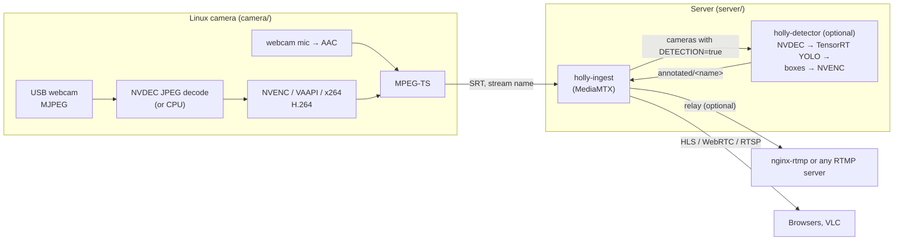

# Holly-Stream


USB webcams on any Linux machine, streamed to a server that draws real-time object detection on every frame with
its NVIDIA GPU. The same branch runs the camera, the server, or both on one machine.

> **Use the `linux` branch.** Each branch of this repository is a different pipeline for different hardware
> (`raspbian`, `jetson`, `linux`); this README describes `linux`. The `*_develop` branches are work in progress. The
> commands below clone `linux` directly; in an existing clone, run `git checkout linux`.


```mermaid
flowchart LR
    subgraph Cam["Linux camera (camera/)"]
        USB["USB webcam<br/>MJPEG"] --> Dec["NVDEC JPEG decode<br/>(or CPU)"]
        Dec --> Enc["NVENC / VAAPI / x264<br/>H.264"]
        Mic["webcam mic → AAC"] --> TS["MPEG-TS"]
        Enc --> TS
    end

    subgraph Server["Server (server/)"]
        Ingest["holly-ingest<br/>(MediaMTX)"]
        Detector["holly-detector (optional)<br/>NVDEC → TensorRT YOLO →<br/>boxes → NVENC"]
    end

    TS -- "SRT, stream name" --> Ingest
    Ingest -- "cameras with DETECTION=true" --> Detector
    Detector -- "annotated/&lt;name&gt;" --> Ingest
    Ingest -- "relay (optional)" --> Out["nginx-rtmp or any RTMP server"]
    Ingest -- "HLS / WebRTC / RTSP" --> Viewers["Browsers, VLC"]
```

## How it works

**Each camera** is one container, `holly-camera`, running FFmpeg. It captures the webcam's MJPEG, decodes and
encodes it as H.264 on the best hardware the machine has, encodes the webcam's microphone to AAC, and sends both
to the server over SRT. Its settings live in `camera/camera.env`: the server's address, a **stream name**, and
whether it wants **detection**.

**The server** runs up to two containers:

- **`holly-ingest`** (MediaMTX, always on, no GPU) receives every camera on one SRT port and serves each one over
  HLS, WebRTC and RTSP. If `RELAY_URL` is set, it relays every camera to another server (e.g. nginx-rtmp for a
  website and recordings) under its stream name.
- **`holly-detector`** (optional, NVIDIA GPU) picks up cameras with `DETECTION=true`. For each one it decodes on
  the GPU, runs YOLO with TensorRT on every frame, draws the boxes, re-encodes, and publishes the result to the
  ingest as `annotated/<stream name>`.

For a camera with detection on, the relay sends the annotated stream; for the others, the plain stream. If the
detector is stopped or crashes, detection cameras fall back to plain within seconds and switch back when it
returns, so a relayed stream never goes away because of detection.

The server is the same one the `raspbian` branch uses, so Raspberry Pi, Jetson and Linux cameras can all stream to
it. Nothing on the server changes when cameras are added, moved or removed.

## Why it is built this way

The previous version of this branch ran everything in one Python process per camera: OpenCV captured and decoded
the webcam, each frame was sent to Triton over gRPC, boxes were drawn on a BGR copy, and raw frames were piped to
an FFmpeg x264 encoder pushing RTMP to nginx. Every frame crossed the CPU several times, detection ran on a
subset of frames to keep up, and a slow inference or network hiccup backed up the whole stream.

| | Previous (OpenCV + Triton + x264) | Now |
|---|---|---|
| Video path | Python frame loop, raw BGR piped to x264 | FFmpeg only; on NVIDIA the pixels never reach the CPU |
| Detection | Every 2nd-6th frame, adaptive | Every frame, 30 per second |
| Transport | RTMP (TCP) to nginx | SRT (UDP with retransmission) to MediaMTX |
| Viewing | nginx HLS | HLS, WebRTC (under a second), RTSP, plus relay to nginx |
| Server side | Triton per camera machine | One shared ingest and detector for every camera |

Measured on a 4-core server with a GTX 1660 and a Logitech C922 at 1280x720@30:

- Camera, NVIDIA path (NVDEC JPEG decode → range conversion on the GPU → NVENC), with audio: about 0.4 of a core,
  0.45 at 1920x1080. The same camera on x264: about 1-1.25 cores.
- Detector, YOLO26s: 30 fps, ~5 ms inference, ~10 ms per frame including drawing and encoding.

Design choices:

- **Hardware first, chosen at start.** `ENCODER=auto` tries NVENC, then VAAPI (Intel/AMD), then falls back to x264.
  `run.sh` only gives the container the GPU when Docker's NVIDIA runtime is installed.
- **Limited range, flagged.** Webcams send full-range JPEG. The camera converts to the limited range that streams
  and players expect and tags the colour description, and the detector carries it through, so dark and bright areas
  are not crushed.
- **A clean start.** The first 3 seconds, captured while the encoder is still starting, are dropped. A burst of
  startup backlog puts audio and video on different clocks at the ingest, which RTSP readers such as the detector
  correct with a timestamp jump. The detector also drops audio that jumps backwards rather than restarting.
- **Rotation happens on the camera.** Unlike a Pi, a Linux machine flips a frame for almost nothing, and doing it
  there means the plain and annotated streams match.
- **A watchdog.** If no frame is sent for `WATCHDOG_SECONDS`, the camera exits and Docker restarts it, which also
  covers a webcam that was unplugged and plugged back in.

## Repository layout

```
run.sh, stop.sh, status.sh  start, stop or check the camera on this machine
run-all-cameras.sh          start every camera listed in .env over SSH (also stop-all-, status-all-cameras.sh)
all-cameras.sh              what the *-all-cameras.sh scripts run (the same on every branch)
.env.example                the camera list for the *-all-cameras.sh scripts
camera/                     camera side
  camera.env.example        settings template, copied to camera/camera.env
  holly-camera.sh           the FFmpeg pipeline, hardware detection and watchdog
  compose.yml, Dockerfile   the holly-camera container
server/                     server side
  compose.yml               holly-ingest, plus holly-detector under the "detection" profile
  .env.example              server settings
  mediamtx.yml, relay.sh    ingest configuration and relay
  status.sh                 connected cameras, detection and relay state
  Dockerfile, holly/        detector: supervisor, per-camera pipeline, TensorRT engine, overlay
  export_model.sh           exports a YOLO model to ONNX in server/models/
docker-push.sh              builds and pushes the camera and detector images
```

## Server setup

**Requirements:** Linux with Docker and the compose plugin. For detection: an NVIDIA GPU (Turing / GTX 16xx or
newer), driver 560+, the NVIDIA Container Toolkit, and Python with `pip install ultralytics onnx onnxslim` to
export models.

```bash
git clone -b linux https://github.com/rcland12/holly-stream.git
cd holly-stream/server
cp .env.example .env         # set SERVER_LAN_IP, and RELAY_URL if you relay to another server

# Plain streaming only
docker compose up -d

# With object detection
./export_model.sh yolo26m.pt
docker compose --profile detection up -d
docker compose logs -f holly-detector
```

With detection, the first start builds a TensorRT engine for the GPU (3-5 minutes), cached in
`server/models/engines/`. The detector is ready when it logs `Watching http://holly-ingest:9997 for cameras`.
Without a GPU, skip the profile; cameras with `DETECTION=true` then simply stream plain.

### In an existing compose stack

Copy the two services from `server/compose.yml` into your stack, point the volume paths at this repository,
and set `RELAY_URL` on `holly-ingest`. If the relay target is a container in the same stack, use its service name,
e.g. `rtmp://nginx:1935/{name}`, with nginx-rtmp `application` blocks and stream keys matching your stream names.
Leave the ingest's HLS port unpublished if something else serves HLS on 8888. The detector reads its settings from
any env file with the variables in `server/.env.example`.

## Camera setup

**Requirements:** Linux with Docker and the compose plugin, and a USB (UVC) webcam. For hardware encoding, either
an NVIDIA GPU with the NVIDIA Container Toolkit, or an Intel/AMD GPU with `/dev/dri`. Without either, the camera
encodes on the CPU.

```bash
git clone -b linux https://github.com/rcland12/holly-stream.git ~/dev/holly-stream
cd ~/dev/holly-stream
cp camera/camera.env.example camera/camera.env
nano camera/camera.env         # SERVER_HOST, STREAM_NAME, DETECTION
./run.sh
```

The camera can run on the server itself: set `SERVER_HOST=127.0.0.1`. **It never starts on its own**, not on
install and not on boot: it streams from `run.sh` until `stop.sh`, restarting itself after errors in between.
The first start builds the image (a minute or two).

`docker logs holly-camera` shows what it picked:

```
[holly-camera] Streaming C922 Pro Stream Webcam /dev/video0 1280x720@30 mjpeg, encoder=nvenc 4000k, rotation=0
hflip=0, audio=plughw:CARD=Webcam,DEV=0, detection=1 -> srt://127.0.0.1:8890 as hollystream6/hollyvideostream6
```

### Starting and stopping cameras

On a camera: `./run.sh`, `./stop.sh` and `./status.sh`.

For all cameras at once, from any machine with SSH keys for them (e.g. the server, or wherever a phone shortcut
connects to), list them in `.env` in the repository root:

```bash
cp .env.example .env
nano .env        # CAMERA_HOSTNAMES=(rusty rustypi2 rustynano)
```

```bash
./run-all-cameras.sh
./stop-all-cameras.sh
./status-all-cameras.sh
```

They reach every camera in parallel and run its `run.sh`, `stop.sh` or `status.sh` in `~/dev/holly-stream` (set
`CAMERA_REPO_PATHS` for other locations). Any camera whose clone has those scripts can be in the list, so cameras
running the `raspbian`, `jetson` and `linux` branches can be controlled together.

What the server is receiving:

```bash
./server/status.sh
```

```
STREAM                          FROM        ROTATE  DETECTION             RELAYING
hollystream6/hollyvideostream6  172.20.0.1  0       on, 29.9 fps, 5.1 ms  annotated
```

### Changing a camera

- **Detection on or off:** set `DETECTION=true` or `false` in `camera/camera.env`, then `./stop.sh && ./run.sh`.
  The server needs the detector running (`--profile detection`) for boxes to appear.
- **Move a camera:** change its `STREAM_NAME` and restart it. Only one camera can use a name at a time; a second
  one is refused until the first disconnects.
- **Update:** `git pull` on the `linux` branch, then `docker compose -f camera/compose.yml --profile '*' build`
  and `./stop.sh && ./run.sh`.
- **Logs:** `docker logs -f holly-camera`.

### Watching

Directly from the ingest, on your LAN, with `<name>` being a stream name or `annotated/<stream name>`:

- HLS in a browser (with audio): `http://<server>:8888/<name>`
- WebRTC in a browser (sub-second latency, video only): `http://<server>:8889/<name>`
- VLC: `rtsp://<server>:8554/<name>`

With `RELAY_URL` set, also wherever it points, e.g. your nginx-rtmp's HLS and recordings.

## Configuration

### Camera (`camera/camera.env`)

Apply changes by restarting the camera: `./stop.sh && ./run.sh`.

| Variable | Default | Description |
|---|---|---|
| `SERVER_HOST` | required | The server's hostname or LAN IP, `127.0.0.1` on the server itself |
| `SERVER_PORT` | `8890` | The ingest's SRT port |
| `STREAM_NAME` | required | Name this camera streams under, e.g. `hollystream6/hollyvideostream6`; relayed to `RELAY_URL` with `{name}` replaced by it |
| `DETECTION` | `false` | `true` to have the server draw object detections on this camera |
| `SRT_LATENCY_MS` | `200` | Retransmission window; raise to 500-1000 over WiFi |
| `CAMERA_DEVICE` | `auto` | The first webcam, a device such as `/dev/video2`, or a name from `ls /dev/v4l/by-id` |
| `WIDTH` / `HEIGHT` / `FPS` | `1280` / `720` / `30` | Capture size; must be a mode the camera lists (the log prints them if not) |
| `INPUT_FORMAT` | `auto` | `h264` (sent as is, for cameras with an encoder), `mjpeg` or `yuyv422`; auto picks in that order |
| `CAMERA_CONTROLS` | `exposure_dynamic_framerate=0` | v4l2 controls, space separated (`v4l2-ctl --list-ctrls`) |
| `ROTATION` / `HFLIP` | `0` / `false` | `0`, `90`, `180` or `270` degrees clockwise, and mirroring |
| `ENCODER` | `auto` | `nvenc`, `vaapi` or `x264`; auto tries them in that order |
| `NVIDIA_GPU` | `0` | Which GPU decodes and encodes, as its index in `nvidia-smi -L` |
| `BITRATE_KBPS` | `4000` | Camera to server bitrate |
| `KEYINT_SECONDS` | `2` | Keyframe interval (2 lines up with 2 second HLS segments) |
| `AUDIO_DEVICE` | `auto` | `auto` (the webcam's own microphone), `none`, or an ALSA device such as `plughw:1,0` |
| `AUDIO_CHANNELS` / `AUDIO_BITRATE_KBPS` | `1` / `96` | AAC settings |
| `WATCHDOG_SECONDS` | `15` | Restart the pipeline if no frame is sent for this long |

### Server (`server/.env`)

Apply changes with `docker compose up -d` (plus `--profile detection` if used).

| Variable | Default | Description |
|---|---|---|
| `SERVER_LAN_IP` | empty | Server address advertised to WebRTC viewers |
| `HLS_PORT` | `8888` | Host port for the ingest's HLS player |
| `RELAY_URL` | empty | Relay every camera here, `{name}` = stream name, e.g. `rtmp://192.168.1.10:1935/{name}` |
| `MODEL` | `yolo26m_480x640.onnx` | Detector model in `server/models/` |
| `CLASSES` | `[0, 16]` | Class indexes to draw, `[]` for all (COCO: 0 person, 15 cat, 16 dog) |
| `CONFIDENCE_THRESHOLD` | `0.35` | Minimum score to draw |
| `BOX_SMOOTHING` | `0.5` | 0 draws raw boxes; higher is steadier but trails fast motion more |
| `SANTA_HAT` | `false` | Holiday overlay: detections of `SANTA_HAT_CLASSES` wear a Santa hat instead of a box |
| `SANTA_HAT_CLASSES` | `[16]` | Classes that get the hat (they must also be in `CLASSES`) |
| `SANTA_HAT_SCALE` | `0.6` | Hat width as a fraction of the box's shorter side |
| `BITRATE_KBPS` | `4500` | NVENC bitrate of annotated streams |
| `SNAPSHOT_INTERVAL` | `0` | Save a clean frame from each detection camera every N seconds to `server/data/snapshots/` |
| `LOG_STATS` | `false` | Log each detection camera's fps and timings every 10 seconds |

## Choosing a model

COCO val2017 at 640, TensorRT FP16 on a GTX 1660. The detector feeds the model half-resolution frames: a 1280x720
webcam fills a 480x640 model with no resize (and bars top and bottom), as does a 1280x960 Pi camera.

| Model | Inference | mAP50-95 | Person AP | Person recall @0.3 | Dog AP | Dog recall @0.3 |
|---|---|---|---|---|---|---|
| YOLO26n | 2.1 ms | 40.2 | 51.7 | 62% | 65.3 | 74% |
| YOLO26s | 3.8 ms | 48.0 | 59.6 | 73% | 72.3 | 81% |
| **YOLO26m** | 8.2 ms | 52.4 | 63.1 | 78% | 76.3 | 86% |
| YOLO11n | 2.2 ms | 38.9 | 51.8 | 64% | 64.5 | 73% |
| YOLO11s | 3.9 ms | 46.4 | 57.9 | 72% | 71.0 | 78% |
| YOLO11m | 8.5 ms | 51.0 | 62.3 | 75% | 74.5 | 84% |

YOLO26 matches YOLO11's speed at each size and is more accurate for people and dogs. Every detection camera runs
every frame, and they share the GPU's ~33 ms per 30 fps frame: YOLO26m suits one or two detection cameras,
YOLO26s three or more, or a GPU that is often busy with other work. `server/status.sh` shows each camera's
inference time. Going over that budget does not fail loudly: it drops frames, which looks like stutter.

## Custom models

Train a YOLO detection model the normal Ultralytics way, on the server's GPU or anywhere else.

1. **Collect images.** With detection on for the cameras you want, set `SNAPSHOT_INTERVAL=60` and restart the
   detector. Each saves an unannotated frame every minute to `server/data/snapshots/`. Set it back to `0` when you
   have enough; the files are owned by root, so `sudo chown -R $USER server/data` before labeling.
2. **Label** in YOLO format with [CVAT](https://www.cvat.ai/), [Label Studio](https://labelstud.io/) or
   [Roboflow](https://roboflow.com/). Label every class you want detected: fine-tuning replaces the 80 COCO
   classes, so a model trained only on your dog stops detecting people.
3. **Train**, starting from pretrained weights at the detector's input size:
   ```bash
   yolo detect train data=data.yaml model=yolo26m.pt imgsz=640 epochs=100 device=0
   ```
4. **Export and use it:**
   ```bash
   ./server/export_model.sh runs/detect/train/weights/best.pt
   ```
   It prints the class indexes. Set `MODEL=best_480x640.onnx` and `CLASSES`, then restart the detector.

## Troubleshooting

**`run.sh` says the camera is not streaming.** `docker logs holly-camera` names the problem: a missing setting, no
webcam, a size the webcam does not offer (the log lists what it does), or the server unreachable (`Connection
setup failure`: check `SERVER_HOST` and that port 8890/udp is open). It keeps retrying until `./stop.sh`. In
`docker compose logs holly-ingest` on the server, `someone is already publishing` means another camera already
uses that stream name.

**Device or resource busy.** Only one program can capture from a webcam. Stop anything else using it, such as the
old `holly-stream-app` container (`docker rm -f holly-stream-app`).

**The stream stutters in a dark room.** Many webcams halve their frame rate in low light. `CAMERA_CONTROLS` turns
that off with `exposure_dynamic_framerate=0` (Logitech); the picture gets darker instead. Other cameras name it
differently: see `v4l2-ctl --list-ctrls`.

**`encoder=x264` although the machine has an NVIDIA GPU.** Install the NVIDIA Container Toolkit so Docker lists
an `nvidia` runtime (`docker info | grep -i runtime`), then `./stop.sh && ./run.sh`. `ENCODER=nvenc` forces the GPU
and shows the error if it still fails.

**No sound.** `AUDIO_DEVICE=auto` only uses a microphone on the webcam itself. For another one, find it with
`arecord -l` and set e.g. `AUDIO_DEVICE=plughw:1,0`.

**Detection is on but `server/status.sh` shows `detector not running`.** Start it with
`docker compose --profile detection up -d`. Until then the camera streams plain.

**`RELAYING` shows `no`.** `RELAY_URL` is empty, or the relay cannot reach it:
`docker compose logs holly-ingest | grep relay` shows why. It retries on its own.

**Stutter over WiFi.** Raise `SRT_LATENCY_MS` to 500-1000, or lower `BITRATE_KBPS`.

**Low fps for detection cameras.** If inference time in `server/status.sh` is past ~25 ms, use a smaller model.

## License

MIT. See [LICENSE](LICENSE).
