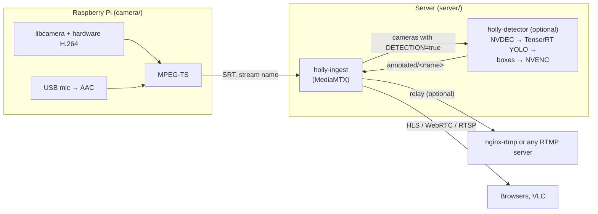

# Holly-Stream


Raspberry Pi security cameras that stream to a server, with optional real-time object detection drawn on every
frame by the server's NVIDIA GPU. Each camera chooses for itself whether it gets detection.

> **Use the `raspbian` branch.** Each branch of this repository is a different pipeline for different hardware
> (`raspbian`, `jetson`, `linux`); this README describes `raspbian`. The `*_develop` branches are work in
> progress. The commands below clone `raspbian` directly; in an existing clone, run `git checkout raspbian`.


```mermaid
flowchart LR
    subgraph Pi["Raspberry Pi (camera/)"]
        Cam["libcamera + hardware H.264"] --> TS["MPEG-TS"]
        Mic["USB mic → AAC"] --> TS
    end

    subgraph Server["Server (server/)"]
        Ingest["holly-ingest<br/>(MediaMTX)"]
        Detector["holly-detector (optional)<br/>NVDEC → TensorRT YOLO →<br/>boxes → NVENC"]
    end

    TS -- "SRT, stream name" --> Ingest
    Ingest -- "cameras with DETECTION=true" --> Detector
    Detector -- "annotated/&lt;name&gt;" --> Ingest
    Ingest -- "relay (optional)" --> Out["nginx-rtmp or any RTMP server"]
    Ingest -- "HLS / WebRTC / RTSP" --> Viewers["Browsers, VLC"]
```

## How it works

**Each Pi** runs one systemd service, `holly-camera`: a GStreamer pipeline that captures the camera, encodes
H.264 with the Pi's hardware encoder, encodes the microphone to AAC, and sends both to the server over SRT. The
Pi runs no Docker, Python or model. Its settings live in `/etc/holly-stream/camera.env`: the server's address, a
**stream name**, and whether it wants **detection**.

**The server** runs up to two containers:

- **`holly-ingest`** (MediaMTX, always on, no GPU) receives every camera on one SRT port and serves each one over
  HLS, WebRTC and RTSP. If `RELAY_URL` is set, it relays every camera to another server (e.g. nginx-rtmp for a
  website and recordings) under its stream name.
- **`holly-detector`** (optional, NVIDIA GPU) picks up cameras with `DETECTION=true`. For each one it decodes on
  the GPU, runs YOLO with TensorRT on every frame, draws the boxes, re-encodes, and publishes the result to the
  ingest as `annotated/<stream name>`.

For a camera with detection on, the relay sends the annotated stream; for the others, the plain stream. If the
detector is stopped or crashes, detection cameras fall back to plain within seconds and switch back when it
returns, so a relayed stream never goes away because of detection.

Nothing on the server changes when cameras are added, moved or removed.

## Why it is built this way

The first versions ran detection on the Pi 4. Its CPU tops out around 5 detections per second with a small
YOLO at 256x320, and the Python frame loop competed with the stream for the same four cores. The streams go to
the server anyway, so detection moved there:

| | Detection on the Pi 4 (previous) | Detection on the server GPU (this) |
|---|---|---|
| Detections | ~5 per second | every frame, 30 per second |
| Model | YOLO11n at 256x320 | YOLO26m at 480x640 (or s) |
| Person AP50-95 (COCO val2017) | 39.2 | 63.1 (m), 59.6 (s) |
| Person recall at 0.3 confidence | 48% | 78% (m), 73% (s) |
| Pi CPU | ~1.5 cores, Python in the video path | ~40% of one core, all hardware encode |

Measured with a 1280x960@30 camera on a GTX 1660 shared with Plex:

- Per detection camera: 30 fps, ~10 ms YOLO26m inference, one NVENC session, ~390 MB of VRAM. The detector held
  30 fps with the GPU saturated by another job.
- Plain cameras cost the server a copy-only relay: no decoding or encoding.
- A restarted camera, ingest or detector recovers on its own within seconds.

Design choices:

- **SRT** from the Pi: UDP with retransmission, so WiFi packet loss costs a resend inside a fixed latency window
  (300 ms) instead of stalling a TCP connection.
- **Native GStreamer on the Pi**, from Raspberry Pi OS packages, so libcamera always matches the kernel and
  firmware.
- **Frames stay NV12 on the server.** The GPU converts only the half-resolution copy the model needs (a 1280x960
  frame is exactly a 480x640 model input), and boxes are drawn straight onto the NV12 planes before NVENC.
- **Boxes are steadied**: detections are matched frame to frame, smoothed, and held through a few missed frames.
- **Rotation happens on the server.** A software flip costs the Pi 4 a full core; the server flips a frame in
  about a millisecond.

## Repository layout

```
camera/                     Raspberry Pi side
  install.sh                install or update the camera service (run on the Pi)
  uninstall.sh              remove it (run on the Pi)
  camera.env.example        settings template, installed to /etc/holly-stream/camera.env
  holly-camera.sh           the GStreamer pipeline
  holly-camera.service      systemd unit
  remote.sh                 start/stop/restart/status/logs for cameras over SSH, from any machine
server/                     server side
  compose.yml               holly-ingest, plus holly-detector under the "detection" profile
  .env.example              server settings
  mediamtx.yml, relay.sh    ingest configuration and relay
  status.sh                 connected cameras, detection and relay state
  Dockerfile, holly/        detector: supervisor, per-camera pipeline, TensorRT engine, overlay
  export_model.sh           exports a YOLO model to ONNX in server/models/
docker-push.sh              builds and pushes the detector image
```

## Server setup

**Requirements:** Linux with Docker and the compose plugin. For detection: an NVIDIA GPU (Turing / GTX 16xx or
newer), driver 560+, the NVIDIA Container Toolkit, and Python with `pip install ultralytics onnx onnxslim` to
export models.

```bash
git clone -b raspbian https://github.com/rcland12/holly-stream.git
cd holly-stream/server
cp .env.example .env         # set SERVER_LAN_IP, and RELAY_URL if you relay to another server

# Plain streaming only
docker compose up -d

# With object detection
./export_model.sh yolo26m.pt
docker compose --profile detection up -d
docker compose logs -f holly-detector
```

With detection, the first start builds a TensorRT engine for the GPU (3-5 minutes), cached in
`server/models/engines/`. The detector is ready when it logs `Watching http://holly-ingest:9997 for cameras`.
Without a GPU, skip the profile; cameras with `DETECTION=true` then simply stream plain.

### In an existing compose stack

Copy the two services from `server/compose.yml` into your stack, point the volume paths at this repository,
and set `RELAY_URL` on `holly-ingest`. If the relay target is a container in the same stack, use its service name,
e.g. `rtmp://nginx:1935/{name}`, with nginx-rtmp `application` blocks and stream keys matching your stream names.
Leave the ingest's HLS port unpublished if something else serves HLS on 8888. The detector reads its settings from
any env file with the variables in `server/.env.example`.

## Camera setup

**Requirements:** Raspberry Pi 4 or 5 with Raspberry Pi OS Bookworm or Trixie, a libcamera-supported camera
module, and optionally a USB microphone.

On the Pi:

```bash
git clone -b raspbian https://github.com/rcland12/holly-stream.git
cd holly-stream/camera
sudo ./install.sh
sudo nano /etc/holly-stream/camera.env     # SERVER_HOST, STREAM_NAME, DETECTION, ROTATION
```

`install.sh` installs GStreamer and the service but does not start it. Start the camera on the Pi with
`sudo systemctl enable --now holly-camera`, or from any machine that can SSH to it:

```bash
./camera/remote.sh start rustypi6
```

### Day to day

From the server (or any machine with SSH access to the Pis):

```bash
./camera/remote.sh start rustypi6               # start now and on every boot
./camera/remote.sh stop rustypi6                # stop and keep stopped across reboots
./camera/remote.sh restart rustypi6             # after editing camera.env
./camera/remote.sh status rustypi2 rustypi6     # running?, stream name, detection, rotation
./camera/remote.sh logs rustypi6                # follow the camera's log
./server/status.sh                              # what the server is receiving
```

```
STREAM                          FROM          ROTATE  DETECTION              RELAYING
hollystream3/hollyvideostream3  192.168.1.21  0       off                    plain
hollystream4/hollyvideostream4  192.168.1.20  0       on, 30.1 fps, 10.3 ms  annotated
```

- **Turn detection on or off:** set `DETECTION=true` or `false` in the Pi's `/etc/holly-stream/camera.env`, then
  `remote.sh restart`. The server needs the detector running (`--profile detection`) for boxes to appear.
- **Move a camera:** change its `STREAM_NAME` and restart. Only one camera can use a name at a time; a second one
  is refused until the first disconnects.
- **Update a camera:** `git pull` on the Pi (on the `raspbian` branch), then `sudo ./install.sh` again. It keeps `camera.env`, adds any new
  settings with their defaults, and restarts the camera if it was running.
- **Remove a camera:** `sudo ./uninstall.sh` on the Pi (`--purge` also deletes its settings).

### Watching

Directly from the ingest, on your LAN, with `<name>` being a stream name or `annotated/<stream name>`:

- HLS in a browser (with audio): `http://<server>:8888/<name>`
- WebRTC in a browser (sub-second latency, video only): `http://<server>:8889/<name>`
- VLC: `rtsp://<server>:8554/<name>`

With `RELAY_URL` set, also wherever it points, e.g. your nginx-rtmp's HLS and recordings.

## Configuration

### Camera (`/etc/holly-stream/camera.env`)

Apply changes with `remote.sh restart <pi>` or `sudo systemctl restart holly-camera`.

| Variable | Default | Description |
|---|---|---|
| `SERVER_HOST` | required | The server's LAN address |
| `SERVER_PORT` | `8890` | The ingest's SRT port |
| `STREAM_NAME` | required | Name this camera streams under, e.g. `hollystream4/hollyvideostream4`; relayed to `RELAY_URL` with `{name}` replaced by it |
| `DETECTION` | `false` | `true` to have the server draw object detections on this camera |
| `ROTATION` | `0` | `180` for an upside-down camera |
| `SRT_LATENCY_MS` | `300` | Retransmission window; raise to 500-1000 on weak WiFi |
| `WIDTH` / `HEIGHT` / `FPS` | `1280` / `960` / `30` | Capture size; 4:3 uses the full sensor on most modules |
| `BITRATE_KBPS` | `6000` | Pi to server bitrate |
| `KEYINT_SECONDS` | `2` | Keyframe interval (2 lines up with 2 second HLS segments) |
| `CAMERA_OPTIONS` | `exposure-value=0.5` | `libcamerasrc` properties, e.g. `brightness=0.1 awb-mode=indoor` |
| `AUDIO_DEVICE` | `auto` | `auto`, `none`, or an ALSA device such as `plughw:1,0` |
| `AUDIO_CHANNELS` / `AUDIO_BITRATE_KBPS` | `1` / `96` | AAC settings |

List every camera property with `gst-inspect-1.0 libcamerasrc` on the Pi.

### Server (`server/.env`)

Apply changes with `docker compose up -d` (plus `--profile detection` if used).

| Variable | Default | Description |
|---|---|---|
| `SERVER_LAN_IP` | empty | Server address advertised to WebRTC viewers |
| `HLS_PORT` | `8888` | Host port for the ingest's HLS player |
| `RELAY_URL` | empty | Relay every camera here, `{name}` = stream name, e.g. `rtmp://192.168.1.10:1935/{name}` |
| `MODEL` | `yolo26m_480x640.onnx` | Detector model in `server/models/` |
| `CLASSES` | `[0, 16]` | Class indexes to draw, `[]` for all (COCO: 0 person, 15 cat, 16 dog) |
| `CONFIDENCE_THRESHOLD` | `0.35` | Minimum score to draw |
| `BOX_SMOOTHING` | `0.5` | 0 draws raw boxes; higher is steadier but trails fast motion more |
| `BITRATE_KBPS` | `4500` | NVENC bitrate of annotated streams |
| `SNAPSHOT_INTERVAL` | `0` | Save a clean frame from each detection camera every N seconds to `server/data/snapshots/` |
| `LOG_STATS` | `false` | Log each detection camera's fps and timings every 10 seconds |

## Choosing a model

COCO val2017 at 640 (the detector runs 480x640, the same pixels for a 4:3 frame), TensorRT FP16 on a GTX 1660:

| Model | Inference | mAP50-95 | Person AP | Person recall @0.3 | Dog AP | Dog recall @0.3 |
|---|---|---|---|---|---|---|
| YOLO26n | 2.1 ms | 40.2 | 51.7 | 62% | 65.3 | 74% |
| YOLO26s | 3.8 ms | 48.0 | 59.6 | 73% | 72.3 | 81% |
| **YOLO26m** | 8.2 ms | 52.4 | 63.1 | 78% | 76.3 | 86% |
| YOLO11n | 2.2 ms | 38.9 | 51.8 | 64% | 64.5 | 73% |
| YOLO11s | 3.9 ms | 46.4 | 57.9 | 72% | 71.0 | 78% |
| YOLO11m | 8.5 ms | 51.0 | 62.3 | 75% | 74.5 | 84% |

YOLO26 matches YOLO11's speed at each size and is more accurate for people and dogs. Every detection camera runs
every frame, and they share the GPU's ~33 ms per 30 fps frame: YOLO26m suits one or two detection cameras,
YOLO26s three or more, or a GPU that is often busy with other work. `status.sh` shows each camera's inference time.

## Custom models

Train a YOLO detection model the normal Ultralytics way, on the server's GPU or anywhere else.

1. **Collect images.** With detection on for the cameras you want, set `SNAPSHOT_INTERVAL=60` and restart the
   detector. Each saves an unannotated frame every minute to `server/data/snapshots/`, straight from the live
   stream. A day of snapshots covers the lighting changes. Set it back to `0` when you have enough; the files are
   owned by root, so `sudo chown -R $USER server/data` before labeling.
2. **Label** in YOLO format with [CVAT](https://www.cvat.ai/), [Label Studio](https://labelstud.io/) or
   [Roboflow](https://roboflow.com/). Label every class you want detected: fine-tuning replaces the 80 COCO
   classes, so a model trained only on your dog stops detecting people.
3. **Train**, starting from pretrained weights at the detector's input size:
   ```bash
   yolo detect train data=data.yaml model=yolo26m.pt imgsz=640 epochs=100 device=0
   ```
4. **Export and use it:**
   ```bash
   ./server/export_model.sh runs/detect/train/weights/best.pt
   ```
   It prints the class indexes. Set `MODEL=best_480x640.onnx` and `CLASSES`, then restart the detector. The
   TensorRT engine for the new model builds on that start.

## Troubleshooting

**`status.sh` does not list the camera.** Run `./camera/remote.sh logs <pi>`. A missing setting is named there.
`Socket is broken or closed` means the Pi cannot reach the ingest: check `SERVER_HOST` and that port 8890/udp is
open on the server (Docker-published ports are). In `docker compose logs holly-ingest`,
`someone is already publishing` means another camera already uses that stream name.

**The camera keeps restarting without frames.** Only one process can use the camera. Stop anything else holding
it (`rpicam-*`, an old container) and check `rpicam-hello --list-cameras` on the Pi.

**Detection is on but `status.sh` shows `detector not running`.** Start it with
`docker compose --profile detection up -d`. Until then the camera streams plain.

**`RELAYING` shows `no`.** `RELAY_URL` is empty, or the relay cannot reach it:
`docker compose logs holly-ingest | grep relay` shows why. It retries on its own.

**Stutter over WiFi.** Raise `SRT_LATENCY_MS` on the Pi to 500-1000, or lower its `BITRATE_KBPS`.

**Low fps for detection cameras.** If inference time in `status.sh` is past ~25 ms, use a smaller model.

**Dark image.** Raise `exposure-value` in `CAMERA_OPTIONS` toward 1.0, then add `brightness=0.1`.

## License

MIT. See [LICENSE](LICENSE).
